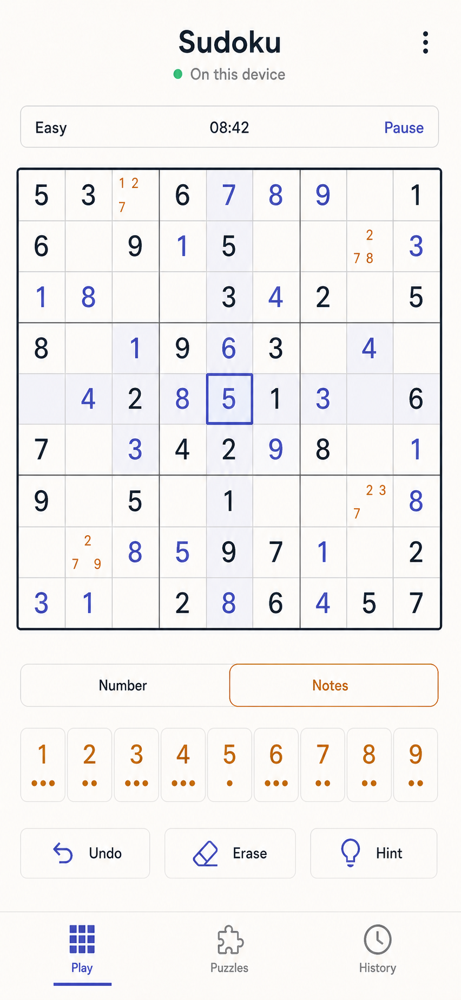
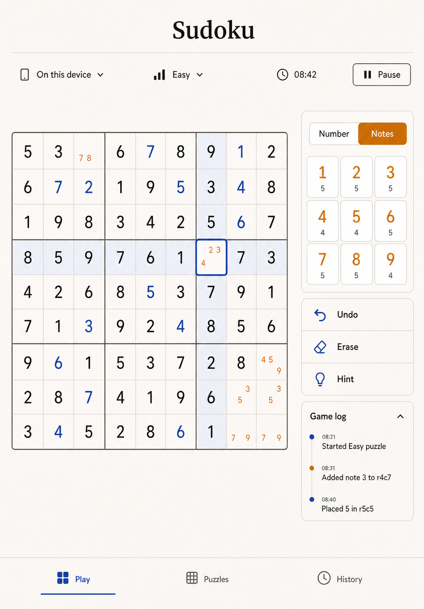
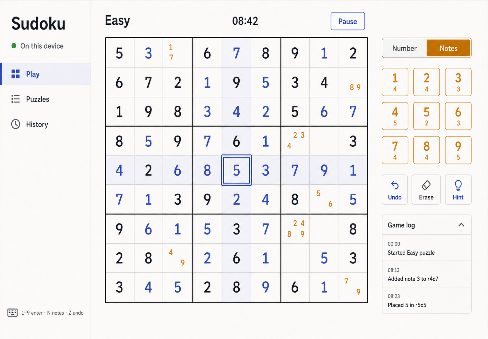

# UX design

Document status: target interaction and visual requirements. The generated
mockups establish hierarchy, density, and tone; they are not implementation or
test evidence. Exact copy, Sudoku validity, semantics, and responsive behaviour
in this document take precedence over pixels in a generated image.

## Design objective

Make the board the obvious centre of attention while keeping every common move
within one action. A returning player should understand the selected cell,
input mode, elapsed state, and available undo at a glance. The app should feel
quiet enough for a long solve and explicit enough to survive an interruption.

The base experience is optimized for a 393×852 phone, then recomposed for an
820×1180 tablet and a 1280×1000 desktop. Responsive design means changing the
control layout, not scaling one composition until text and targets become tiny.

## Generated form-factor mockups

### Phone



At phone width, metadata is compressed into one row, the board uses nearly the
full safe width, number input is a single row, utility actions sit below it,
and primary navigation stays at the bottom. The game log is closed by default
and opens as a full-width sheet so it never competes with the board.

### Tablet



At tablet width, the board and a persistent control rail share the workspace.
The number pad becomes 3×3 and the log can remain visible below the controls.
Bottom navigation remains reachable in portrait; landscape may use the desktop
sidebar when space permits.

### Desktop



At desktop width, primary navigation moves to a left sidebar, the board occupies
the centre, and controls plus game log form a right inspector. Keyboard help is
persistent but quiet. The app uses the viewport rather than stretching the
board beyond a comfortable scan size.

## Information architecture

Primary destinations are:

- **Play** — start or resume the current puzzle;
- **Puzzles** — choose a chapter level, generate a puzzle, and revisit prior
  generated puzzles;
- **History** — review completed and abandoned games;
- **Settings** — checking, note cleanup, timer visibility, motion, and local
  data controls. On phone, Settings is available from the header menu; on wider
  layouts it may be a fourth navigation item.

The status phrase **On this device** appears in the shell and links or expands
to: “Progress and history are stored only in this browser. They are not synced
or backed up.” It must never be represented as a cloud-success indicator.

An active puzzle also offers **Share** beside Restart and Abandon. Its compact
dialog distinguishes a clean puzzle link from a progress transfer. Preparing
progress pauses the source, shows a locally rendered QR code and Copy link
fallback, and plainly says that the recipient receives an independent copy.
Incoming links use a full-view checking/consent card rather than exposing an
unvalidated board. The QR scales before required copy or close actions, so the
same no-scroll and 44 px target rules hold on every supported form factor. The
complete interaction and privacy contract is in
[PUZZLE_SHARING.md](PUZZLE_SHARING.md).

## Primary play flow

### 1. Start or resume

On first launch, Play explains fixed givens, number entry, and notes, then shows
a five-option level picker and **Generate Foundations puzzle** by default.
Changing a level immediately updates its short technique-family summary and the
generation action. Generation runs on-device and shows a cancellable
progress state without starting the game timer. The generated puzzle becomes a
game only after it passes validity, uniqueness, and allowed-technique checks and
the `game/started` event is safely appended.

If the bounded generator attempt budget is exhausted, show: “Could not generate
a puzzle yet.” Actions are **Retry** and **Cancel**. Never display or persist a
partially generated or unvalidated grid.

When an unfinished game exists, Play opens directly to its replayed state. A
small message says “Resumed on this device” once; it does not block input.
Starting another puzzle requires abandoning or finishing the current one in
MVP, avoiding ambiguous active timers.

### 2. Select and inspect a cell

A cell may be selected by tap/click or keyboard navigation. Selection shows:

- a two-pixel indigo outline inside the cell boundary;
- a pale peer highlight on the same row, column, and 3×3 box;
- a stronger but distinct highlight on matching values;
- programmatic `aria-selected="true"` and a complete accessible label.

Tapping the same filled cell a second time switches from that cell's blue peer
set to a pink number-wide view: every instance of the selected digit is
emphasized, along with the union of all of those instances' peers. A third tap,
or selecting a different cell, returns to the ordinary local peer view. This is
ephemeral inspection state and never appends an event.

Given cells are dark and visually heavier. User values are indigo. Notes are a
3×3 mini-grid in the cell and use charcoal by default; amber indicates that the
global Notes mode is active, not that every note is an error or warning.

### 3. Enter a value or note

The mode control has two explicit states: **Number** and **Notes**. Notes mode
uses `aria-pressed`, an amber border/tint, and the text label. It must not rely on
colour or a pencil icon alone. It adds an **All** key immediately after 9; the
key fills pencil marks 1–9 in the selected empty cell as one undoable action. A
local **Start in Notes mode** setting makes Notes the initial mode for newly
opened puzzles without changing existing game snapshots.

Both interaction orders work:

- select a cell, then choose 1–9;
- choose a number, then select a cell (“number-first” mode), if the setting is
  enabled.

On desktop, typing 1–9 affects the selected editable cell. In Number mode it
enters/replaces a value; in Notes mode it toggles that note. A value entry clears
notes in the same cell. Pressing a displayed number again does not erase it;
Erase or Backspace/Delete is explicit.

Each number button exposes its remaining count (`9 - occurrences on the
projected board`) as text available to assistive technology. A completed number
is disabled only when nine correct placements are present; conflicts must not
make a number appear complete.

### 4. Correct, undo, and redo

**Erase** clears the selected editable value or, in Notes mode, all notes in the
selected cell after a second confirmation only if more than three notes would
be removed. The exact threshold is a UX convenience, not domain semantics.

**Undo** and **Redo** name the affected action in their accessible labels, for
example “Undo placed 5 in row 5, column 5.” Undoing and redoing append events;
the user-visible game log shows both the original action and compensation.

Conflicting cells receive a red inset outline plus a conflict icon/label. When
immediate mistake checking is enabled, a wrong value also gets “Does not match
the solution” and increments the mistake count once. When checking is disabled,
the app shows only rule conflicts until completion; it does not leak solution
information.

### 5. Ask for a hint

Hint opens a short confirmation: “Reveal one cell? This will be recorded in
your game summary.” Confirming reveals one deterministic eligible cell, marks it
with a small hint glyph and accessible text, appends a `hint/revealed` event,
and increments the hint count. Cancel changes nothing. Hints never fill several
cells, mutate notes elsewhere, or claim to teach a technique in MVP.

### 6. Pause and return

Pause freezes the active elapsed time and replaces the board values with a
neutral cover saying “Puzzle paused.” It leaves puzzle metadata and Resume
available, while hiding the position visually and from the accessibility tree.
The entire covered board is a labelled Resume control, so a tap anywhere in the
puzzle area continues play; the compact header Resume button remains available
as a second option and keyboard target.
The game log is also unavailable until play resumes so it cannot reveal the
covered position. Closing the app while active is treated as an interruption,
not an automatic pause; elapsed time continues. Closing while paused preserves
the frozen time.

### 7. Complete

When all values match the solution, game controls become read-only and a compact
completion panel appears without covering the board. It says:

```text
Puzzle complete
Advanced · 08:42 · 1 mistake · 0 hints
```

Actions are **View game log**, **Choose another puzzle**, and **Done**. Reduced
motion gets no celebration animation. Standard motion may use a brief border
wash under 400 ms, never confetti, sound, or forced delay.

## Board specification

- Always render exactly 81 cells in row-major order, with stronger boundaries
  after rows and columns 3 and 6.
- The outer board and 3×3 boundaries use at least 3:1 contrast against the
  canvas; cell text meets WCAG 2.2 AA.
- Use tabular numerals and a locally bundled humanist sans-serif. Digits should
  be visually distinct at small sizes.
- Do not encode cells as 81 independent tab stops. The board is one composite
  grid with roving `tabindex`; arrow keys move the active cell.
- The accessible cell name follows this order: position, fixed/editable, value
  or empty, notes, conflict/mistake, selected. Example: “Row 4, column 7,
  editable, empty, notes 2 3 8, selected.”
- The selected cell and all required controls remain visible at 200% zoom; the
  compact layout never relies on focus-induced document scrolling.
- Never expose the solution through DOM attributes, hidden text, accessible
  descriptions, or client-facing debug panels. The solution exists locally for
  validation but is reachable only through domain commands.

## Key states

### No game

Show a short explanation, the five chapter choices, a one-line summary of the
selected technique family, and one calm **Generate [level] puzzle** action. Do
not manufacture percentages when no puzzle has been played.

### In progress

Show difficulty, active elapsed time unless hidden, Pause, board, input mode,
number pad, Undo/Redo/Erase/Hint, and optional log. Disable unavailable actions
instead of hiding their stable positions.

### Paused

Hide board content and disable inputs. Keep both the full-board resume target
and compact header Resume action available. Keep the log covered until play
resumes.

### Conflict or mistake

Keep the entered value so the player can inspect and undo it. A polite live
region announces one concise message. Do not shake the board, steal focus, or
open a modal.

### Complete

Keep the solved board visible and read-only. Show summary values and next
actions. The history card becomes available immediately from the replayed
projection.

### Storage unavailable

Continue the current in-memory solve. Show a persistent but non-modal warning:
“This browser cannot save progress. Keep this page open to continue.” Disable
claims about resume/history; do not disable Sudoku input.

### Corrupt or incompatible stream

Do not partially render the affected game. Say: “This puzzle history cannot be
opened safely.” Offer **Start a new puzzle**, **Clear local data**, and technical
details with the diagnostic code. Other valid games remain visible.

### More than one active tab

Each tab keeps its selected puzzle locally. Tabs viewing the same puzzle remain
editable and quietly follow committed events from one another. A tab may open
or generate another puzzle without changing the puzzle shown elsewhere. If two
commands overlap on the same stream revision, the later transaction is
discarded, the board refreshes, and a live region says that the latest puzzle
state is shown.

### Offline

A healthy installed app needs no alarm. “On this device” remains accurate. If
the shell is not installed, the browser owns the initial network error; the app
must not redirect to a remote fallback.

## Puzzle browser

The puzzle browser offers Foundations, Intermediate, Advanced, Expert, and
Master. They map to the five cumulative curriculum chapters; clue count does
not define the label. The primary action is **Generate [selected level]
puzzle**. Below it, generated puzzle cards contain a stable friendly label
derived from the short seed, status (In progress, Solved, or Abandoned), best
local active time if solved, hint count, and a single clear action. Cards do not
preview givens, expose the full seed by default, or imply that a level was
inferred from clue count alone.

Filtering and sorting are ephemeral; newest generated puzzle is the default.
“Start over” on a completed puzzle creates a new game ID and event stream using
the same committed puzzle definition; history retains both attempts. “Generate
another” uses a new seed and commits a new definition only after validation.

## History and game log

History is newest first and groups attempts by local date. A card shows puzzle
label, difficulty, state, active time, mistakes, hints, and completion time. It
offers **Review board** and **View game log**. Reviewing never reopens a terminal
game for edits.

The game log is generated from events and shown newest-first in the compact
panel, with an option for chronological order in the full view. Each row has a
local elapsed timestamp, icon, readable action, and machine-stable
`data-event-type` for testing. Pencil-note activity may collapse into a summary
after ten consecutive note events, but accessible expansion must reveal every
event and its original order.

The UI does not offer individual history deletion in MVP because silently
removing one stream weakens the simple append-only model. Settings offers one
real privacy operation: **Clear all local Sudoku data**. Confirmation says:
“Delete every puzzle, move, preference, and history item from this browser?
This cannot be undone.” On success, the store key and quarantined copies are
physically removed and the app returns to first launch.

## Responsive layouts

### Phone: 320–599 CSS px

- Header and puzzle metadata use two compact rows at 320 px and one at 393 px.
- Board width is `min(100vw - 24px, available-height allocation)`.
- Number pad is one row at 360 px and above; at 320 px it may wrap to a 5+4 grid
  to preserve usable targets.
- Undo, Redo, Erase, and Hint use a two-by-two grid at 320 px and may use one row
  at 393 px if each target stays at least 44 px.
- Bottom navigation respects safe-area insets.
- The log opens as a modal sheet with an explicit close button and trapped focus.

### Tablet: 600–1023 CSS px

- Portrait uses a board plus right control rail when the board remains at least
  540 px; otherwise controls move below.
- The number pad is 3×3. Utility actions form a vertical or two-column group.
- The game log can remain expanded below the number pad without moving the
  board.
- Landscape may use a left navigation rail and desktop inspector.

### Desktop: 1024 CSS px and above

- Left navigation is 224–256 px, the board is capped near 720 px, and the right
  inspector is 280–320 px.
- The workspace is centred and fits the 1280×1000 reference viewport without
  document scrolling at default text size.
- Keyboard help is persistent. Hover styles supplement rather than replace focus.
- Large monitors gain whitespace, not an oversized board.

## Visual system

- Canvas: warm ivory `#f7f5ef`.
- Primary surface: near-white `#fffdf8`.
- Ink: charcoal `#20242b`.
- Primary/focus/user value: indigo `#4654a3`.
- Selection fill: pale indigo `#eceefa`.
- Notes-mode accent: amber `#b7791f` plus border and text.
- Conflict: deep red `#b42318` plus outline/icon/text.
- Muted border: `#c8c7c2`; strong grid: `#343840`.
- Minimum body text: 16 CSS px; condensed metadata: 14 px; cell values scale
  with the board but never below 20 px at the 320 px viewport.
- Minimum non-board target: 44×44 CSS px with visible focus and 8 px preferred
  separation.
- Borders and spacing define structure; shadow is never the only boundary.

## Content rules

- Use “puzzle,” “number,” “note,” “row,” “column,” “box,” “hint,” and “game log.”
- Use sentence case. Avoid “candidate” in primary UI unless help explains it.
- Say “conflict” for a Sudoku-rule duplicate and “mistake” only when checking
  against the solution is enabled.
- Do not claim progress is saved without adding “on this device.”
- Do not say “perfect” when a solve used no hints/mistakes; report facts.
- Use a fixed-width `r4c7` form only in compact visual logs. Accessible text and
  help spell out “row 4, column 7.”

## Accessibility and usability acceptance

- Meet WCAG 2.2 AA semantics, contrast, focus, reflow, target-size, error, and
  status-message requirements.
- Complete a puzzle using keyboard only and touch only.
- At 200% zoom and 320 CSS px, retain the board and all required controls in one
  viewport with no document or nested scrolling.
- At every supported viewport, keep each state within one screen. Compact
  layouts may hide secondary chrome and paginate unbounded history, but never
  hide required controls behind scrolling or hover.
- Honour reduced motion and forced-colour modes.
- Test screen-reader announcements with VoiceOver in Chromium on macOS. Safari,
  Firefox, WebKit, Windows, and other platform/browser combinations are outside
  the MVP test matrix.
- Avoid focus movement after value/note input; selection remains in the board.
- Dialogs and sheets restore focus to their invoker.

Formative tasks for representative players:

1. inspect every chapter option, generate a Master puzzle, and distinguish a
   given from an editable value;
2. add and remove several notes without accidentally committing a number;
3. identify and correct a row conflict;
4. undo, redo, then create a new branch and explain why redo is unavailable;
5. pause, close, reopen, and resume at the same board and elapsed time;
6. request a hint and find its effect in the game summary and log;
7. finish a puzzle using only the keyboard;
8. find a completed attempt in History;
9. explain what “On this device” does and does not promise;
10. clear all local data and understand that it cannot be recovered.

## Mockup generation record

The three PNGs were generated with the built-in image-generation tool using the
`ui-mockup` use case. The shared prompt requested a high-fidelity, flat,
device-free Sudoku interface; 9×9 board with 3×3 dividers; ivory, charcoal,
indigo, and amber palette; accessible selection; responsive control changes;
local-only status; number/notes modes; undo, erase, hint, navigation, and a
human-readable event log. Form-factor prompts then specified phone stacked,
tablet two-column, and desktop sidebar/inspector compositions. Generated board
digits and small labels are illustrative and must not be used as puzzle fixtures
or visual-regression baselines. A second precise-edit pass changed only the
difficulty and corresponding log labels from Medium to Easy for the original
MVP. These concept mockups predate the compact five-level picker; executable
scenario 002 screenshots are the current visual contract for level selection.
