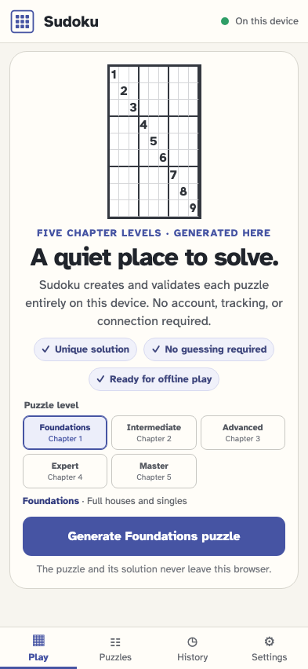

# Application shell and local-only boundary

The static Sudoku client is ready to generate a validated puzzle without an account or remote service.

## The calm local-only shell is ready on this device

**Verifications:**

- [x] The page exposes the stable Sudoku title and welcome heading
- [x] Local storage readiness is visible without an account or cloud claim
- [x] The local five-level puzzle generator is available
- [x] The shell states the unique, no-guess, and offline product promises
- [x] Every browser request is a same-origin GET for the static shell
