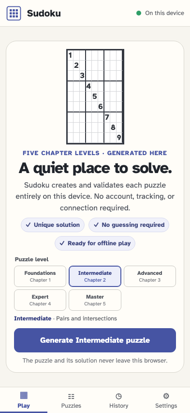
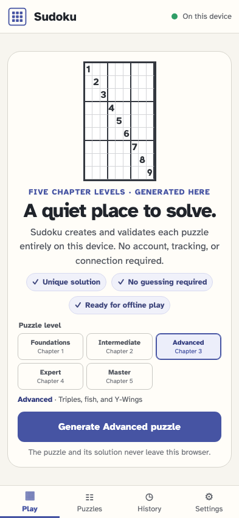
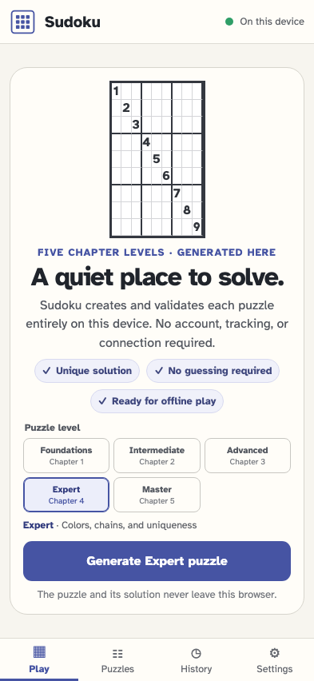
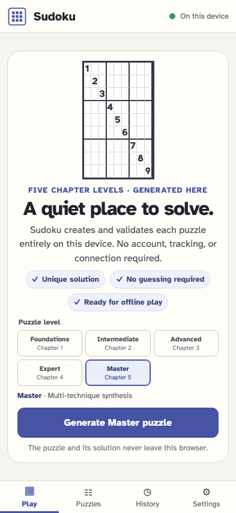
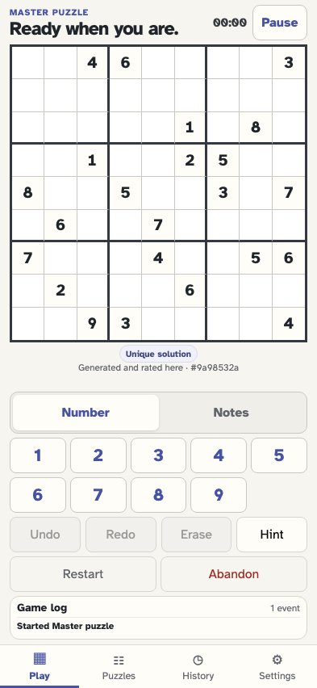

# Choose a chapter level, then generate and start its puzzle

Each chapter choice is visible before a Master puzzle crosses the worker, independent validators, canonical event store, replay, and responsive board.

## A new player sees one clear local generation action

**Verifications:**

- [x] No game exists before the player asks for one
- [x] Generate Foundations puzzle is enabled and promises local validation

## Intermediate is selected as Chapter 2

**Verifications:**

- [x] Intermediate exposes its chapter-matched technique family before generation

## Advanced is selected as Chapter 3

**Verifications:**

- [x] Advanced exposes its chapter-matched technique family before generation

## Expert is selected as Chapter 4

**Verifications:**

- [x] Expert exposes its chapter-matched technique family before generation

## Master is selected as Chapter 5

**Verifications:**

- [x] Master exposes its chapter-matched technique family before generation

## The generated Master puzzle is validated, rated, persisted, and ready to play

**Verifications:**

- [x] The real board has 81 cells with exactly 23 fixed givens
- [x] The UI reports a unique Master puzzle and its stable generated identity
- [x] Exactly one game/started event commits the complete reproducible puzzle
