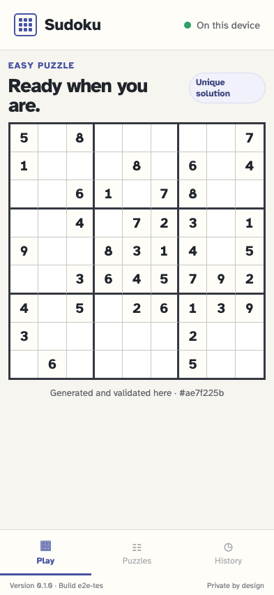

# Generate, validate, and start an Easy puzzle

One deliberate action crosses the worker, independent validators, canonical event store, replay, and responsive board.

## A new player sees one clear local generation action

**Verifications:**

- [x] No game exists before the player asks for one
- [x] Generate Easy puzzle is enabled and promises local validation

## The generated Easy puzzle is validated, persisted, and ready to play

**Verifications:**

- [x] The real board has 81 cells with exactly 40 fixed givens
- [x] The UI reports a unique Easy puzzle and its stable generated identity
- [x] Exactly one game/started event commits the complete reproducible puzzle
