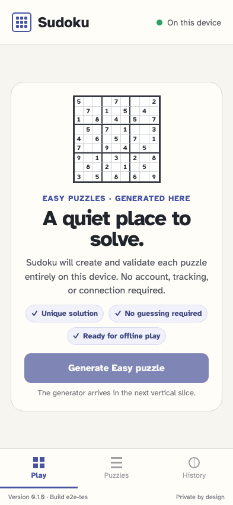

# Installed offline shell

After one online load, the static application shell can close and reopen without a network.

## The installed shell reopens with the network disabled

**Verifications:**

- [x] The cached page keeps its stable Sudoku title
- [x] The welcome screen remains available from the application cache
- [x] Local persistence remains ready while offline
