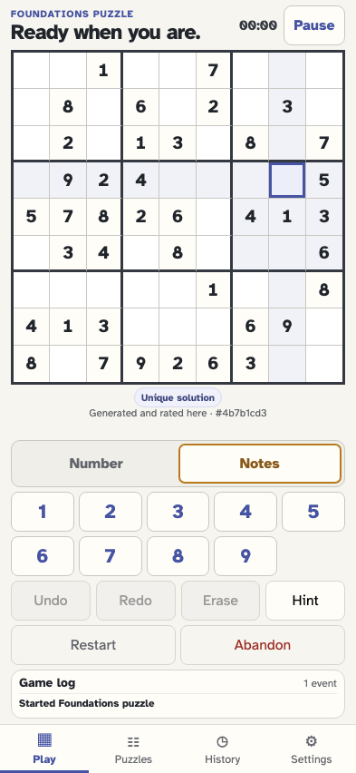
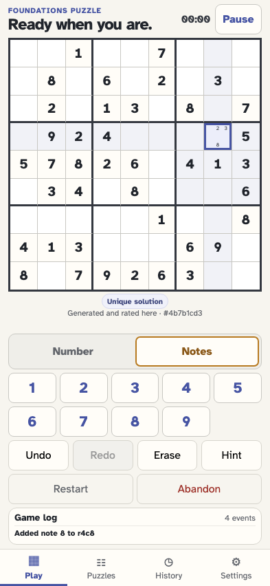
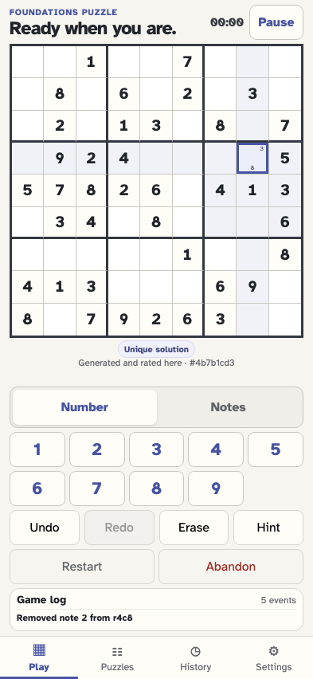
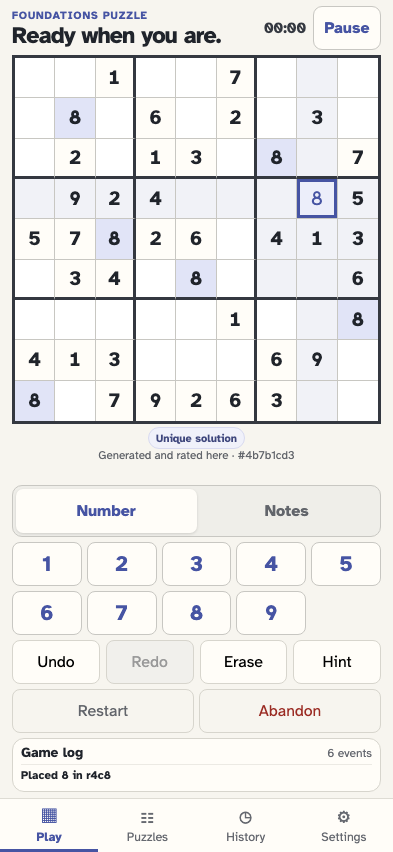
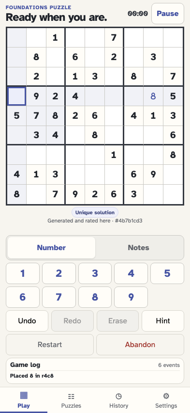
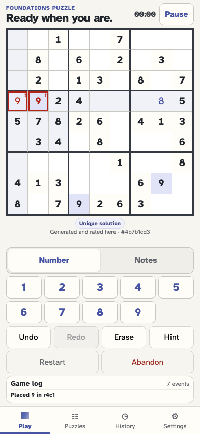

# Values, notes, conflicts, and the game log

Every click below appends either no event or exactly one canonical fact, then replay updates the board and its plain-language log.

## The player has generated a fresh puzzle with an inspectable start event

**Verifications:**

- [x] The board is ready and no editable cell is selected
- [x] The game log begins with exactly one start entry

## A click selects row 4 column 8 and highlights its peers

**Verifications:**

- [x] Row 4 column 8 is the selected editable empty cell
- [x] Selection is ephemeral and appends no event

## The player switches explicitly from Number mode to Notes mode

**Verifications:**

- [x] Notes is visibly and programmatically pressed
- [x] Changing input mode appends no event

## The player adds pencil note 2

**Verifications:**

- [x] The selected cell exposes note 2 in its accessible name
- [x] One cell/note-toggled event records note 2
- [x] The newest game-log row says Added note 2 to r4c8

## The player adds pencil note 3

**Verifications:**

- [x] The selected cell exposes note 3 in its accessible name
- [x] One cell/note-toggled event records note 3
- [x] The newest game-log row says Added note 3 to r4c8

## The player adds pencil note 8

**Verifications:**

- [x] The selected cell exposes note 8 in its accessible name
- [x] One cell/note-toggled event records note 8
- [x] The newest game-log row says Added note 8 to r4c8

## Clicking an existing pencil note removes that note only

**Verifications:**

- [x] The cell retains notes 3 and 8 but no longer announces note 2
- [x] The newest log row says Removed note 2 from r4c8

## The player returns to Number mode before committing a value

**Verifications:**

- [x] Number is visibly and programmatically pressed
- [x] The mode-only click leaves the five-event stream unchanged

## The player commits the correct value and its old notes disappear

**Verifications:**

- [x] Row 4 column 8 contains the committed user value with no notes
- [x] One cell/value-entered event and matching log row record the placement

## The player selects another editable cell in the same row

**Verifications:**

- [x] Row 4 column 1 is selected without changing history

## Entering a duplicate keeps the value visible and clearly marks the row conflict

**Verifications:**

- [x] The entered value and the existing row 4 given both expose conflict state
- [x] The conflict remains a derived projection of one value event
- [x] The visible log preserves the exact newest placement
