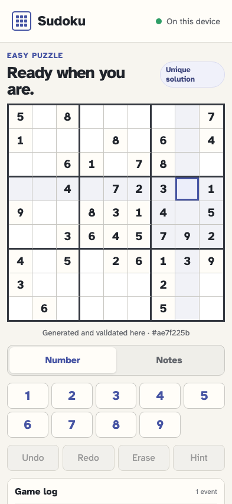
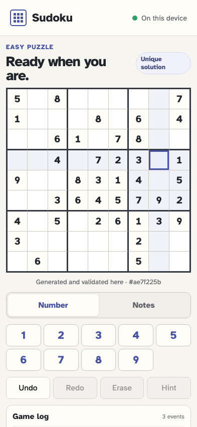
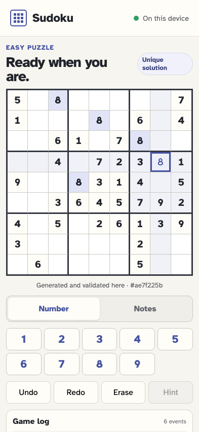
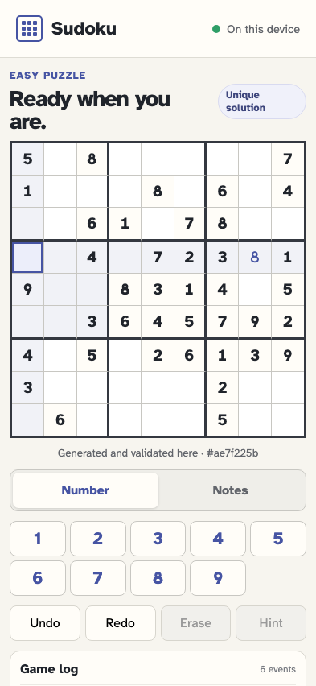
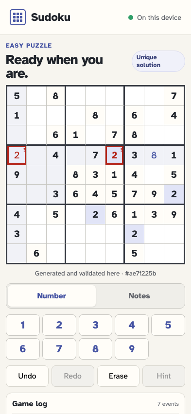

# Erase, undo, redo, and branch

The board moves backward and forward by appending compensating facts; a new move after undo closes the old redo branch without deleting it.

## The player generates the puzzle used for the correction journey

**Verifications:**

- [x] The board and start event are ready

## The player selects row 4 column 8

**Verifications:**

- [x] The cell is selected and Erase remains unavailable while it is empty

## The player enters a value that can now be erased or undone

**Verifications:**

- [x] The value is visible and Erase is enabled
- [x] Undo names the exact placement it will affect

## Erase clears the selected editable cell with one canonical event

**Verifications:**

- [x] Row 4 column 8 is empty again
- [x] The newest event and log row record Erased r4c8

## Undo restores the erased value by appending a compensation

**Verifications:**

- [x] The original value is visible again
- [x] The stream retains clear and appends move/undone

## Redo reapplies the same clear without rewriting the original event

**Verifications:**

- [x] The cell is empty and the clear is again the active move
- [x] The newest event and log entry are move/redone

## The player undoes the clear once more before choosing a new direction

**Verifications:**

- [x] The value is restored and Redo is available

## The player selects a different empty cell while the old clear is redoable

**Verifications:**

- [x] Selection changes without affecting the redo branch

## A new placement commits a branch and makes the old redo unavailable

**Verifications:**

- [x] The new value is visible with its derived conflict and Redo is disabled
- [x] All seven facts remain append-only and the new move is last
- [x] The game log shows the new branch above the retained undo and redo history
