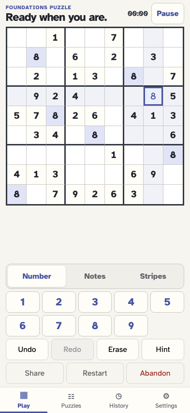
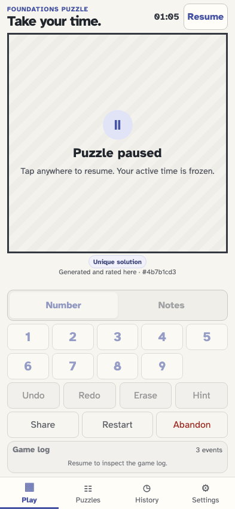
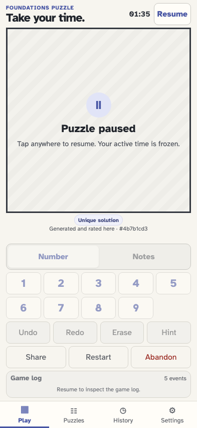
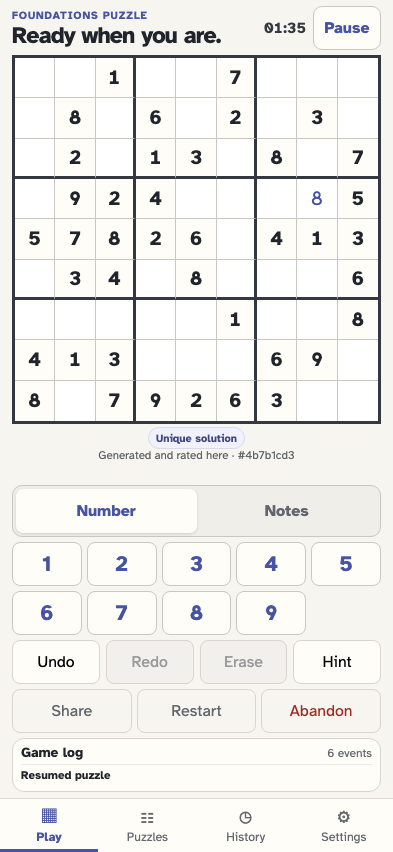

# Pause, reload, and resume

Active time comes from event snapshots. Pausing covers the puzzle, reload replays the same state, and resuming continues without counting the interruption.

## The player generates a fresh puzzle and its active timer starts at zero

**Verifications:**

- [x] The timer begins at 00:00 beside Pause

## The player selects row 4 column 8 before making a move

**Verifications:**

- [x] The editable cell is selected without changing elapsed history

## The player enters a value before the interruption

**Verifications:**

- [x] The value and its event are persisted

## The player pauses after one minute and five seconds of active play

**Verifications:**

- [x] The timer is frozen at 01:05 and Resume is the primary session action
- [x] The board and game log contents are replaced by neutral covers
- [x] game/paused records exactly 65 seconds

## Reload reconstructs the covered puzzle and frozen timer exactly

**Verifications:**

- [x] The paused cover and 01:05 timer survive a full reload
- [x] Reload does not append or rewrite an event

## The player taps the covered puzzle and the exact board returns

**Verifications:**

- [x] The previously entered value is reconstructed and editable controls return
- [x] game/resumed keeps elapsed time at 65 seconds

## A second pause adds only the thirty resumed seconds

**Verifications:**

- [x] The active timer is now exactly 01:35
- [x] The second pause appends 95 seconds without changing earlier facts

## Another reload proves the accumulated active time is replayable

**Verifications:**

- [x] The timer remains frozen at 01:35 after restart
- [x] The canonical five-event document is byte-for-byte unchanged by reload

## The player can still use the header Resume button

**Verifications:**

- [x] The existing compact Resume action restores the board too
- [x] The alternative action appends the same canonical game/resumed event
