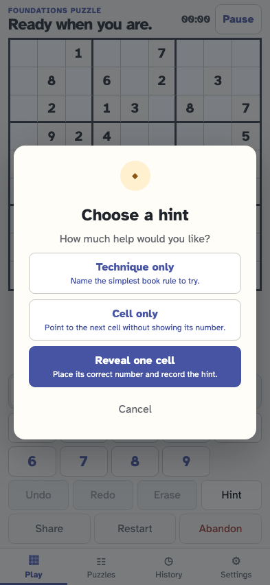
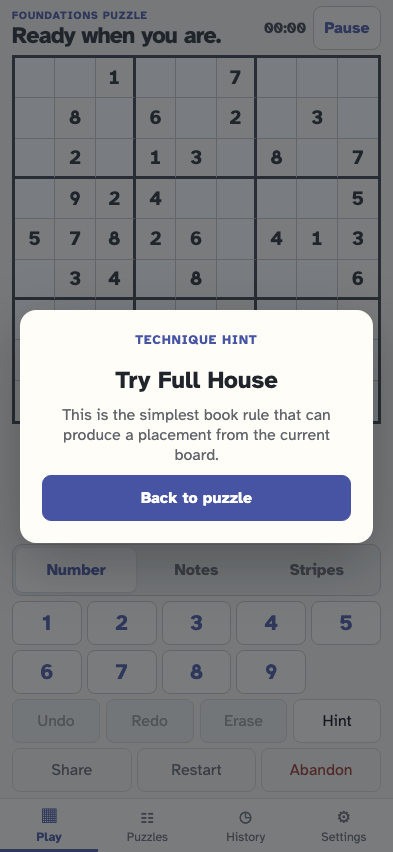
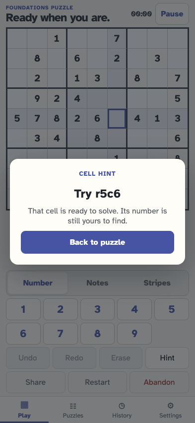
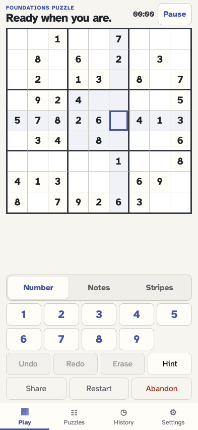
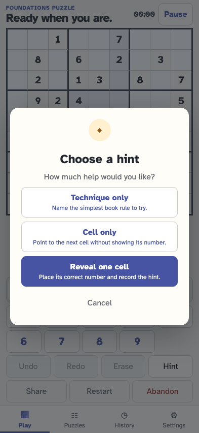
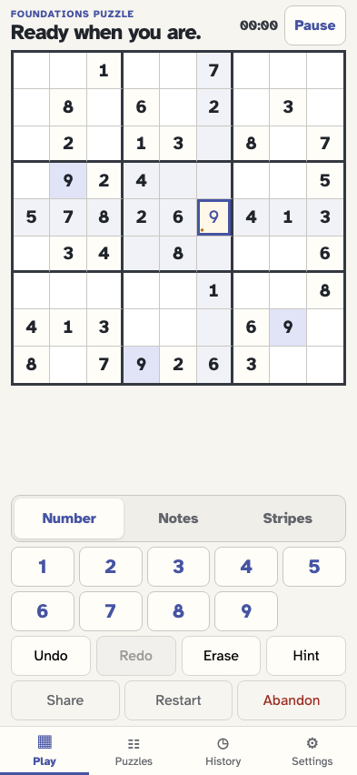

# Choose how much help a hint provides

Technique and cell guidance use the same simplest book-rule placement without changing canonical history. A reveal places that target and records the exact cell and value.

## The generated puzzle offers an enabled Hint action

**Verifications:**

- [x] Hint is available and the summary has no hint event

## The player opens three distinct levels of help

**Verifications:**

- [x] The modal offers technique, cell, and reveal choices
- [x] Opening the choices appends no event

## The player asks only which technique to try

**Verifications:**

- [x] The result names one supported book rule without naming a cell or value
- [x] Technique advice changes no cell and appends no event

## The player asks which cell to solve without seeing its contents

**Verifications:**

- [x] The result names one coordinate and selects that still-empty cell
- [x] Cell advice reveals no number and appends no event

## The player can still cancel from the choice menu

**Verifications:**

- [x] The dialog closes and the board still has only its fixed givens
- [x] Cancellation leaves the event stream unchanged

## The player returns and chooses the full reveal

**Verifications:**

- [x] Reveal one cell is now the explicit confirm action

## Reveal places the same simplest target identified by Cell only

**Verifications:**

- [x] Exactly one cell is labelled as revealed by hint and selected
- [x] One hint/revealed fact records the exact cell and solution value
