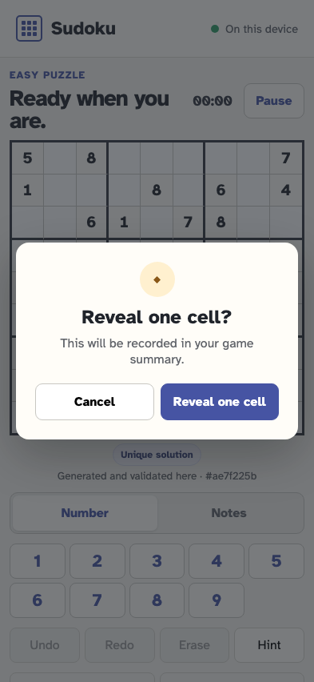
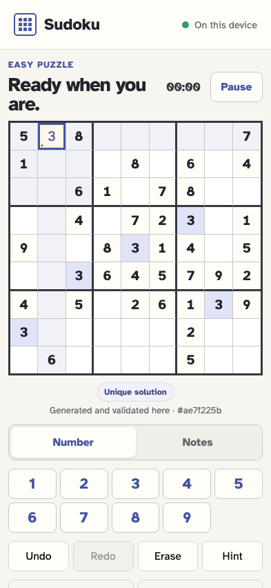

# Cancel and confirm a hint

A hint never changes the board silently: the player sees a confirmation, cancellation is inert, and confirmation records the exact revealed cell and value.

## The generated puzzle offers an enabled Hint action

**Verifications:**

- [x] Hint is available and the summary has no hint event

## The player opens a clear confirmation before revealing anything

**Verifications:**

- [x] The modal explains that the reveal is recorded in the summary
- [x] Opening the confirmation appends no event

## The player cancels and returns to the unchanged puzzle

**Verifications:**

- [x] The dialog closes and the board still has only its fixed givens
- [x] Cancellation leaves the event stream unchanged

## The player deliberately opens the confirmation again

**Verifications:**

- [x] Reveal one cell is now the explicit confirm action

## Confirmation reveals the deterministic lowest-index eligible cell

**Verifications:**

- [x] Exactly one cell is labelled as revealed by hint and selected
- [x] One hint/revealed fact records the exact cell and solution value
- [x] The visible game log describes the same reveal
