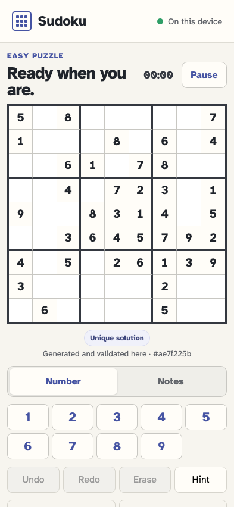
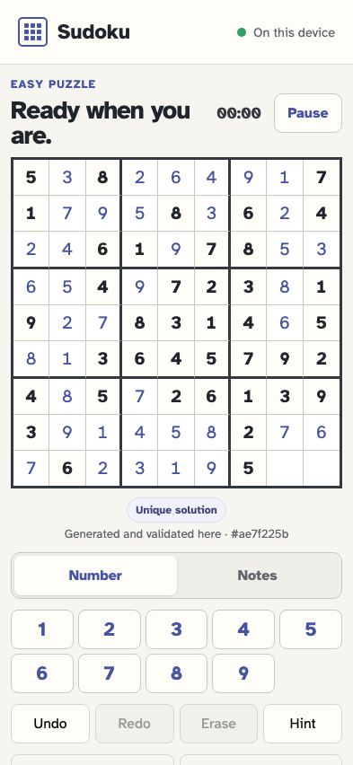
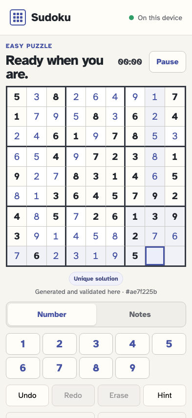
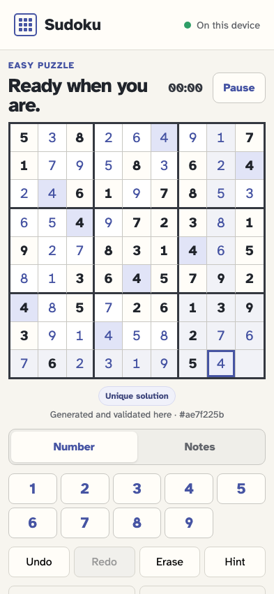
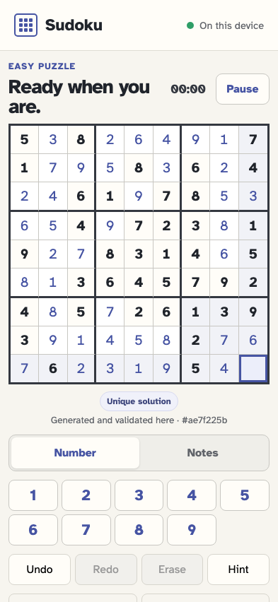
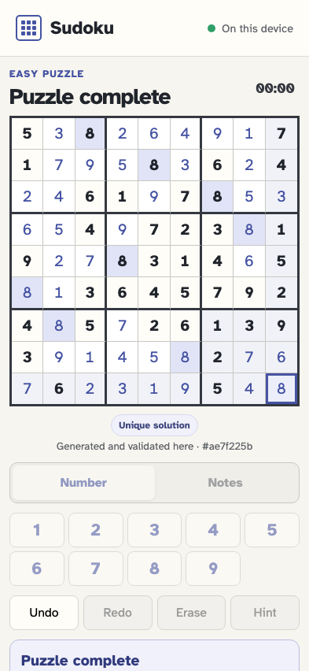
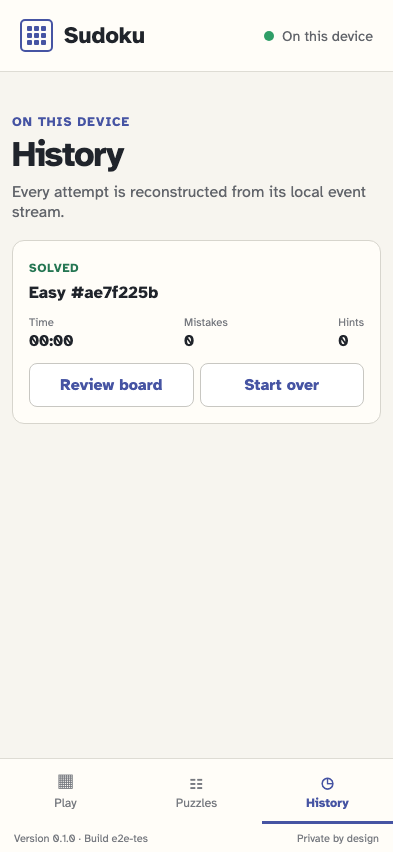
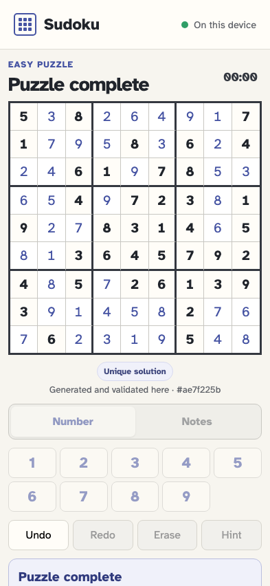

# Complete, review, and repeat a puzzle

A near-complete canonical fixture leaves the final user actions visible. Completion is derived from the last value fact, then History replays the result and can start a distinct attempt on the same puzzle.

## The player generates the puzzle that will be completed

**Verifications:**

- [x] The canonical stream starts with game/started

## The reviewed fixture leaves exactly two editable cells for the player

**Verifications:**

- [x] Exactly two cells remain empty and the puzzle is not yet complete

## The player selects the first of the final two cells

**Verifications:**

- [x] The penultimate cell is selected and empty

## The player fills the penultimate value and play continues

**Verifications:**

- [x] One empty cell remains and no completion panel appears early

## The player selects the one remaining empty cell

**Verifications:**

- [x] The last empty cell has selection and focus state

## The final value completes the puzzle without a redundant completion event

**Verifications:**

- [x] The solved board stays visible beside a factual completion summary
- [x] All play controls are read-only
- [x] The last canonical event remains cell/value-entered while the log derives Solved puzzle

## The player opens History and sees the replayed completed attempt

**Verifications:**

- [x] The newest history card reports Solved with zero mistakes and hints

## Review board replays the solved grid without reopening it for edits

**Verifications:**

- [x] The solved board is visible and number input remains disabled

## The player returns to the same immutable history card

**Verifications:**

- [x] One completed attempt remains available

## Start over creates a fresh attempt using the same committed puzzle

**Verifications:**

- [x] The board resets to its original givens with active controls
- [x] A second game/started event has a new game ID but the same puzzle ID
