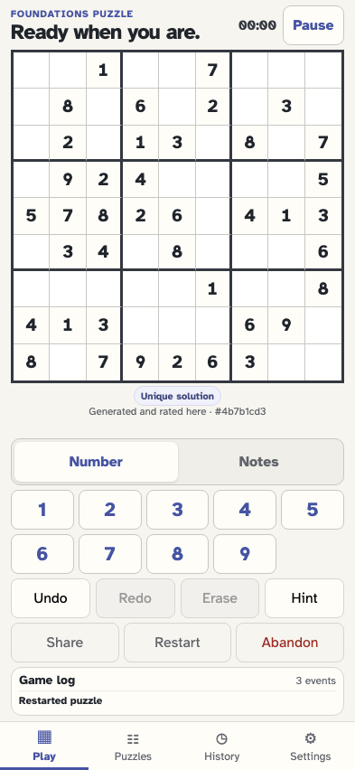
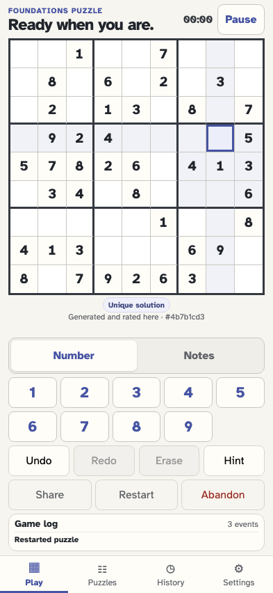
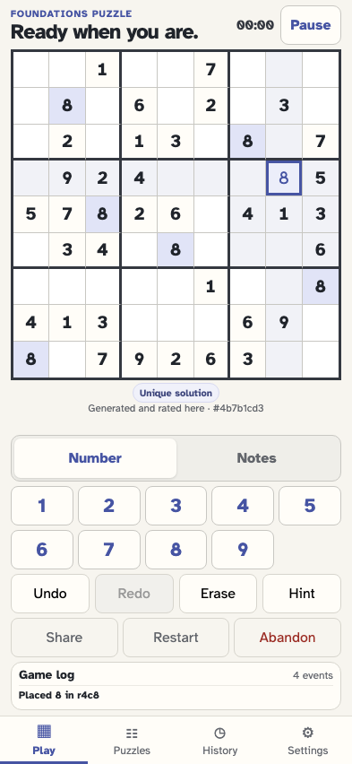
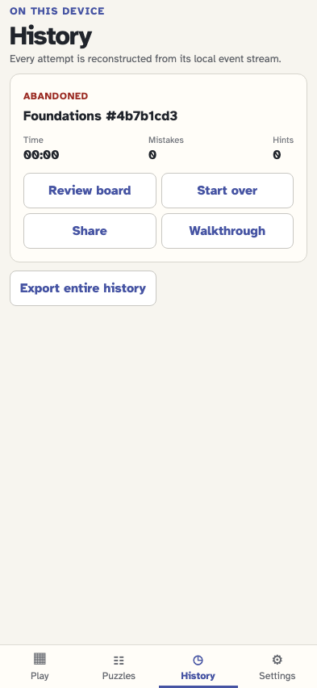
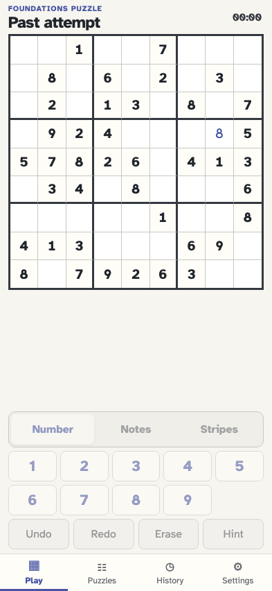

# Restart and abandon an attempt

Restart keeps one game history, resets its mutable cells, and can be undone or redone. Abandon closes the attempt, retains its final board for review, and permits a distinct start-over attempt.

## The player generates an attempt that can be restarted or abandoned

**Verifications:**

- [x] Restart and Abandon are both available

## The player selects an editable cell before the first move

**Verifications:**

- [x] Row 4 column 8 is selected

## The player commits a value that Restart will clear

**Verifications:**

- [x] The value and its placement event are visible

## Restart resets mutable cells but remains reversible

**Verifications:**

- [x] All 41 editable cells are empty again
- [x] game/restarted follows the original value event
- [x] Undo identifies the restart as its next reversible action

## The player selects the reset cell again

**Verifications:**

- [x] Selection remains ephemeral after restart

## The player makes one move in the restarted attempt

**Verifications:**

- [x] The restarted board contains the new value fact

## Abandon closes the unfinished attempt and opens History

**Verifications:**

- [x] History labels the attempt Abandoned
- [x] game/abandoned is the final fact for the attempt

## Review board shows the final abandoned position without edit controls

**Verifications:**

- [x] The last value remains visible and the number pad is disabled

## The player returns to the retained abandoned history card

**Verifications:**

- [x] Exactly one abandoned attempt remains

## Start over creates a clean active attempt from the same puzzle

**Verifications:**

- [x] The original givens return with all editable cells empty
- [x] The second game/started event uses a different game ID
