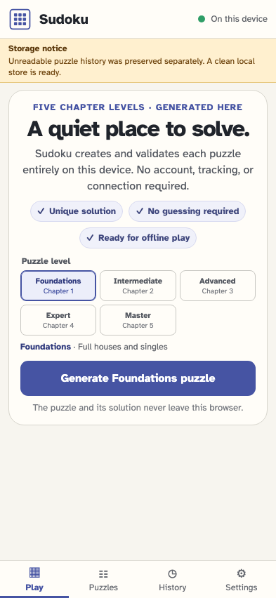
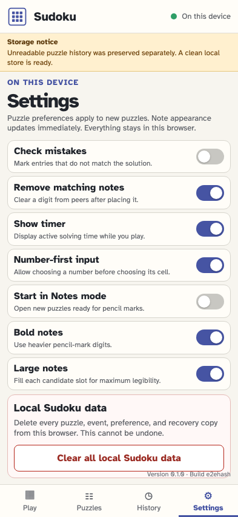
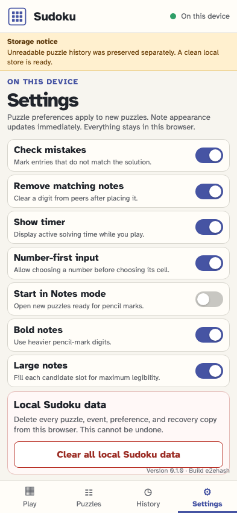
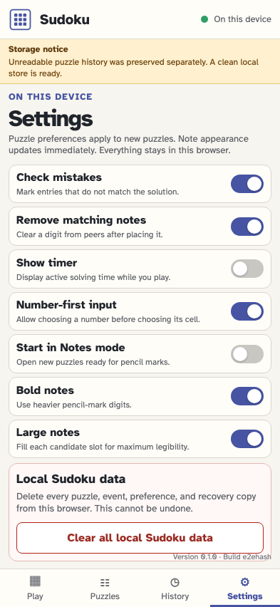
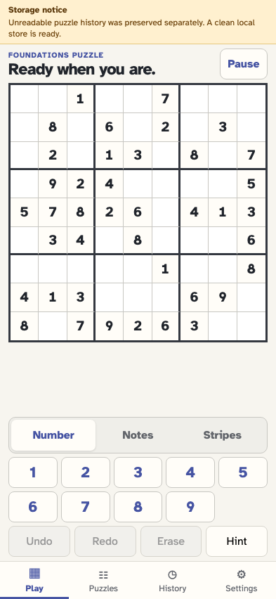
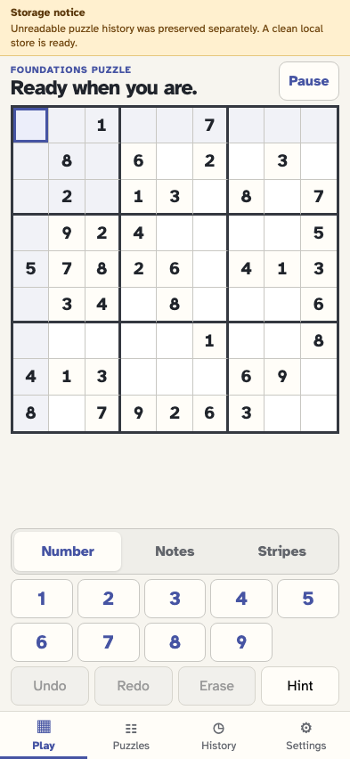
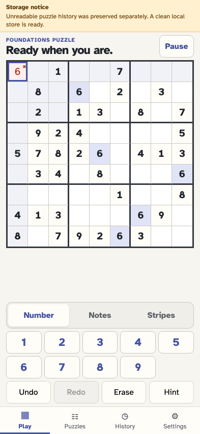
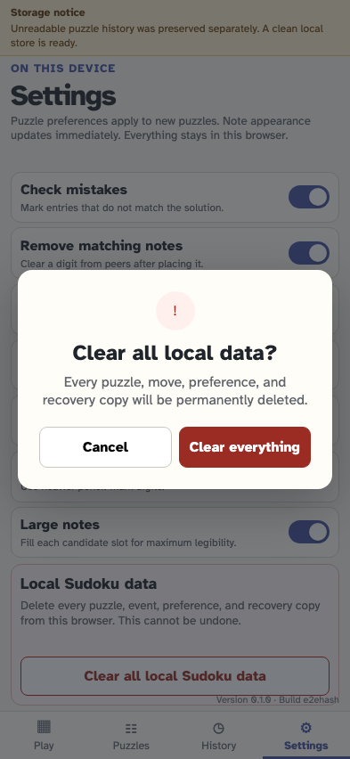
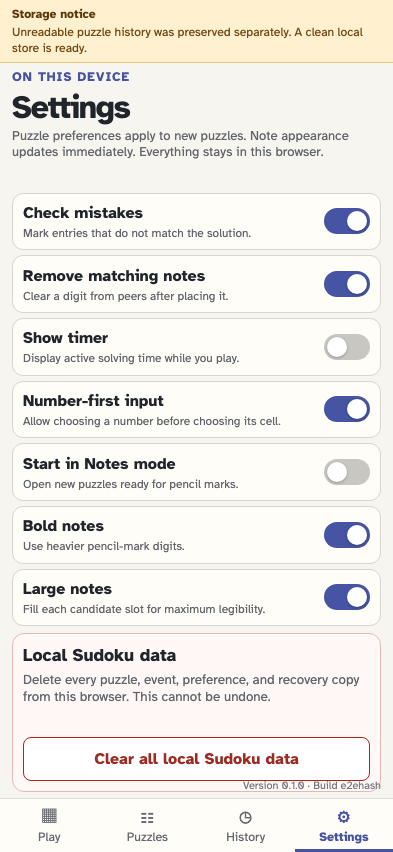

# Recover storage, choose preferences, and clear local data

Malformed history is preserved before a clean start. Preferences are events snapshotted into a new game, and the destructive privacy action names and removes every local Sudoku record.

## Startup preserves unreadable bytes and explains the clean recovery

**Verifications:**

- [x] The canonical key is absent and exactly one recovery copy retains the original bytes

## The player opens local preferences

**Verifications:**

- [x] Seven labelled switches, the clear-data action, and deterministic build details are available

## The player enables immediate mistake checking

**Verifications:**

- [x] The switch is on and settings/changed is the first canonical event

## The player turns off the visible timer for future puzzles

**Verifications:**

- [x] The timer preference is stored as a second app-level event

## The player returns to the empty play view

**Verifications:**

- [x] The recovered clean store is ready to generate

## The player generates a puzzle with the chosen preferences

**Verifications:**

- [x] The game snapshots mistake checking on and timer display off

## The player selects an editable cell before entering a checked value

**Verifications:**

- [x] The chosen cell is selected and still empty

## A wrong but non-conflicting value is visibly identified as a mistake

**Verifications:**

- [x] The cell exposes mistake state and the projection counts one mistake

## The player returns to Settings to manage local data

**Verifications:**

- [x] The saved switches retain their replayed values

## Clear all opens an explicit irreversible confirmation

**Verifications:**

- [x] The dialog names every category and offers Cancel

## Cancel preserves the complete local event stream

**Verifications:**

- [x] The dialog closes and canonical plus recovery keys remain

## The player deliberately opens the destructive confirmation again

**Verifications:**

- [x] Clear everything is ready only inside the modal

## The player permanently clears all local Sudoku data

**Verifications:**

- [x] No sudoku.* key remains and the app returns to a fresh welcome view
