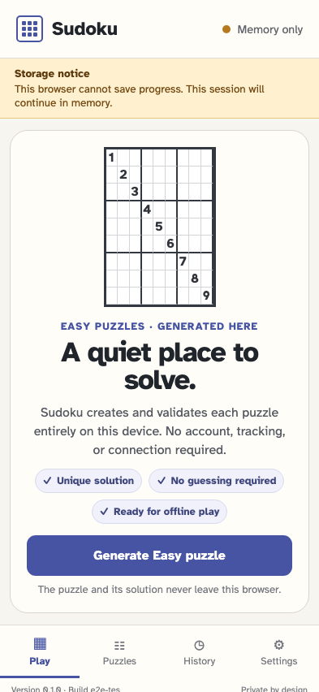
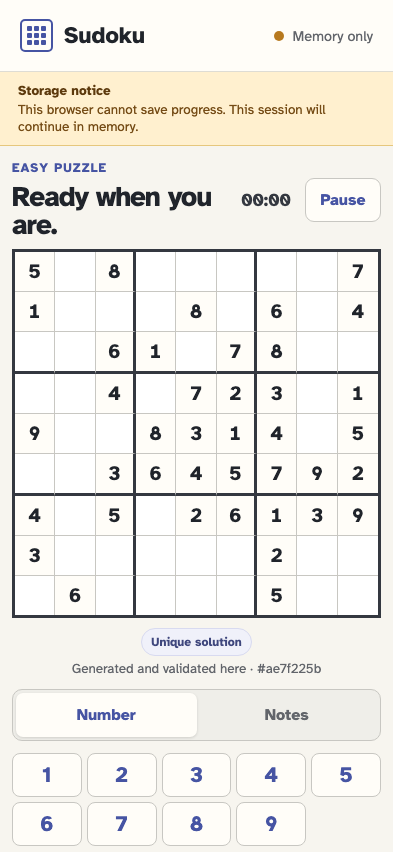

# Continue when browser storage is unavailable

A failed storage probe is visible, specific, and non-fatal: the player can still generate and play for the current tab session.

## Startup explains that progress cannot be saved

**Verifications:**

- [x] Memory only and the exact persistence warning are visible

## The player generates a usable puzzle for this session

**Verifications:**

- [x] The validated board is interactive despite unavailable persistence
