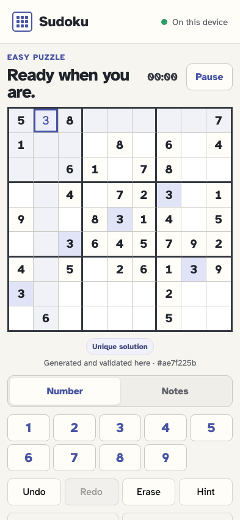
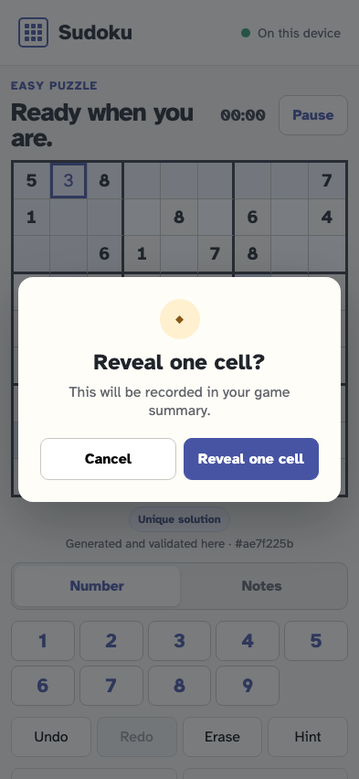
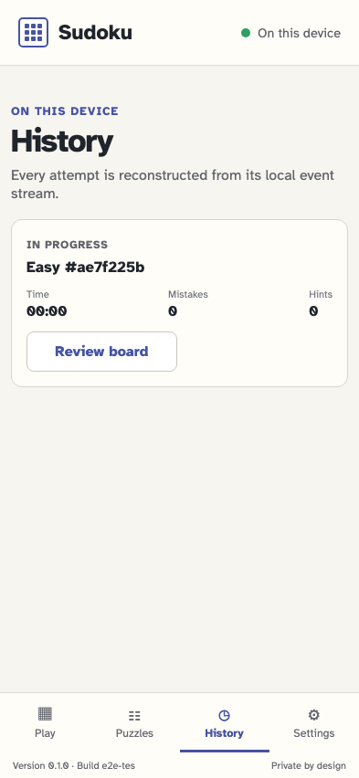
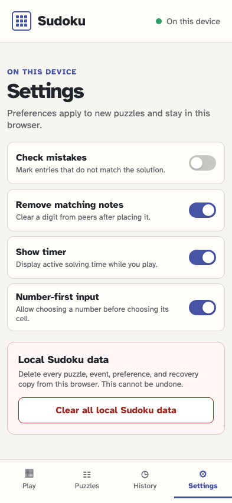
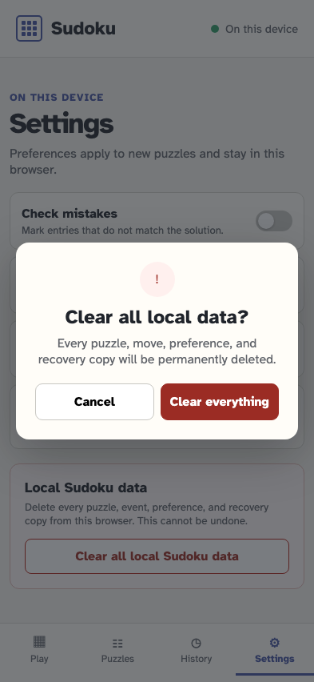

# Keep every puzzle and action on this device

The browser observes the complete runtime request surface while the player generates, enters a value, opens and cancels a hint, visits History and Settings, cancels deletion, and reloads. Only bundled same-origin GET assets are allowed.

## The local-only welcome view loads from bundled same-origin assets

**Verifications:**

- [x] Observed requests are same-origin GETs and CSP restricts connections to self

## The player generates and validates a puzzle locally

**Verifications:**

- [x] Generation adds no external request or beacon

## The player selects an editable cell

**Verifications:**

- [x] Selection stays ephemeral and makes no request

## The player records a value only in the local event stream

**Verifications:**

- [x] cell/value-entered is local and no runtime request follows it

## The player opens the local hint confirmation

**Verifications:**

- [x] The dialog requires consent without contacting a service

## The player cancels without adding an event

**Verifications:**

- [x] The dialog closes and the request surface remains local

## History reconstructs the active game locally

**Verifications:**

- [x] One in-progress card appears without a data request

## The player opens device-local settings

**Verifications:**

- [x] Settings render from replayed local state only

## The player inspects the precise clear-data confirmation

**Verifications:**

- [x] No deletion or network action occurs before confirmation

## The player cancels data deletion

**Verifications:**

- [x] The canonical local event store remains and no request occurs

## A reload reconstructs the same local game without a data API

**Verifications:**

- [x] The event stream survives and every observed request is still a same-origin GET
