# Operate the complete puzzle with touch, mouse, or keyboard

The same semantic grid reflows from a 320 px viewport through landscape, tablet, and desktop. Every keyboard command produces an observable state, and automated accessibility checks run against the playable board.

## The local welcome state fits the current viewport before play begins

**Verifications:**

- [x] Puzzle generation is available without scrolling

## The player generates a board in the current form factor

**Verifications:**

- [x] The labelled grid contains 81 gridcells without horizontal overflow
- [x] Axe reports no WCAG A/AA violations in the playable view

## The player chooses a number before choosing a cell

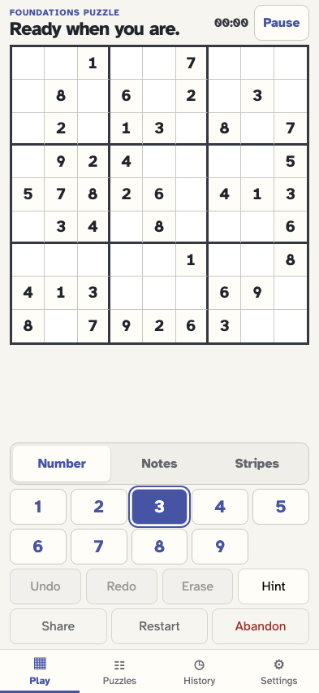

**Verifications:**

- [x] The number pad exposes the selected number through aria-pressed

## Choosing an editable cell commits the previously selected number

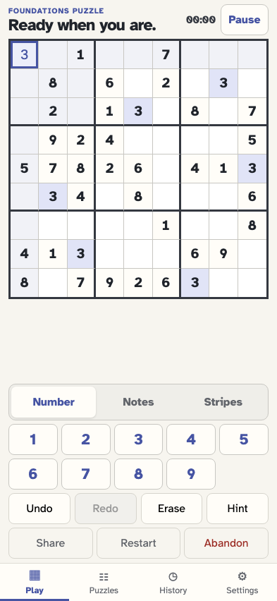

**Verifications:**

- [x] The correct value is stored and the one-shot number selection clears

## The player focuses a new cell before navigating the composite grid

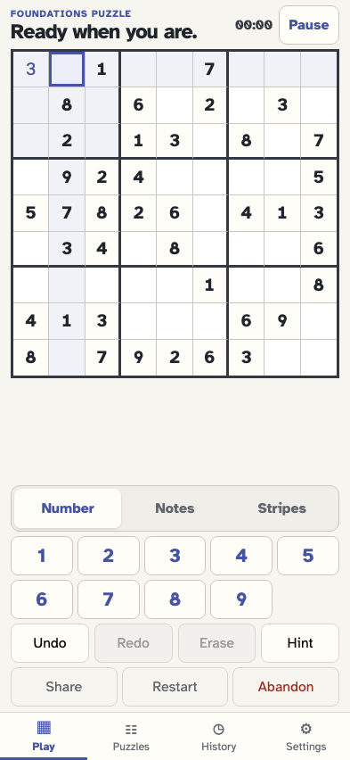

**Verifications:**

- [x] Exactly one selected gridcell is in the tab order

## Arrow Right moves focus and selection one column

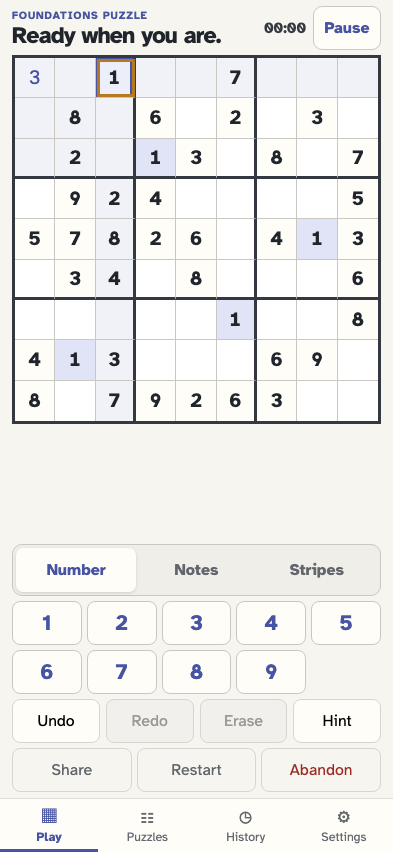

**Verifications:**

- [x] The next cell is focused, selected, and is the sole tab stop

## Home moves to the first cell in the current row

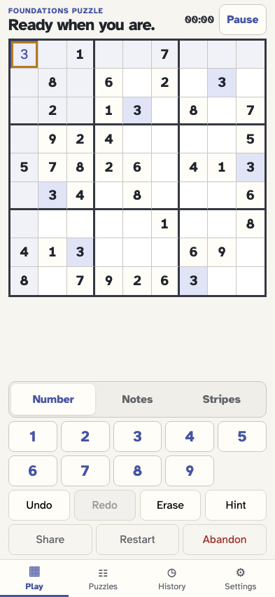

**Verifications:**

- [x] The row-start cell receives focus

## End moves to the last cell in the current row

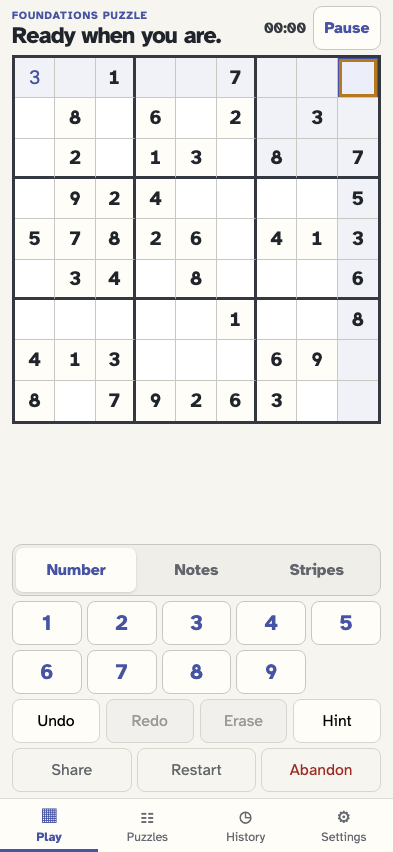

**Verifications:**

- [x] The row-end cell receives focus

## The player focuses an empty editable cell for a keyboard note

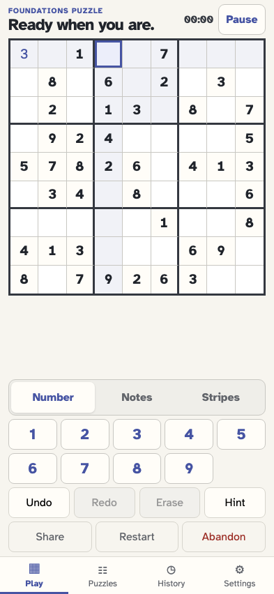

**Verifications:**

- [x] The empty editable cell is selected

## N toggles Notes mode without leaving the grid

**Verifications:**

- [x] Notes is pressed and the cell keeps focus

## A digit key adds a pencil note in Notes mode

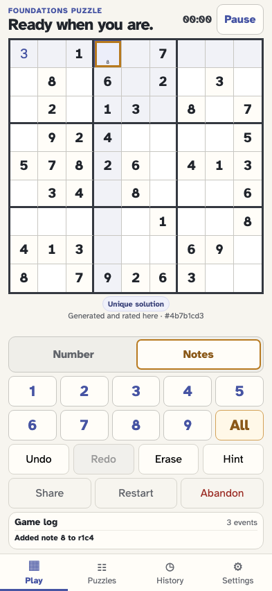

**Verifications:**

- [x] The cell accessible name reports the exact note

## Delete erases the focused cell

**Verifications:**

- [x] The cell becomes empty and cell/cleared is appended

## Z undoes the erase without rewriting history

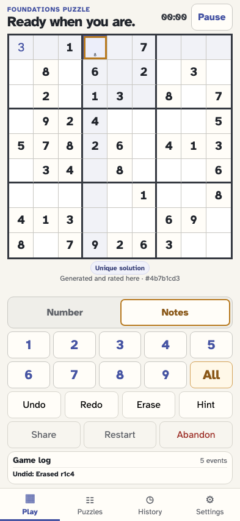

**Verifications:**

- [x] The note returns and move/undone is appended

## Shift+Z redoes the erase

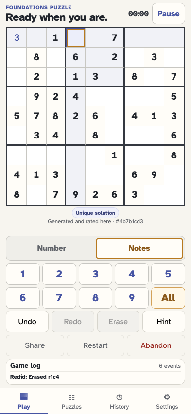

**Verifications:**

- [x] The cell is empty again and move/redone is appended

## The player opens a transient dialog

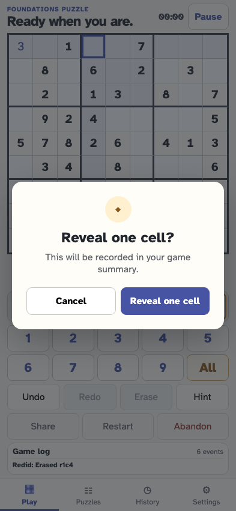

**Verifications:**

- [x] The modal is visible before the Escape command

## Escape closes the topmost transient dialog

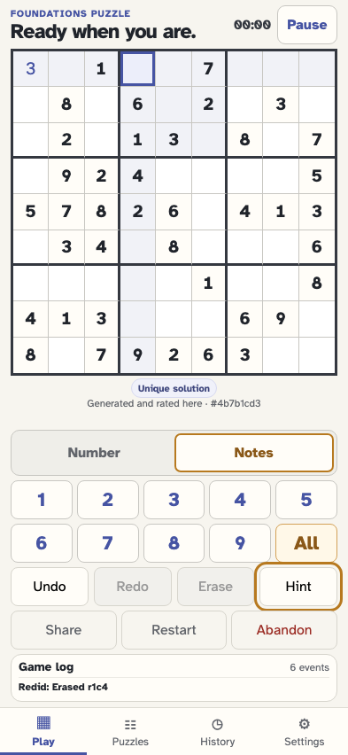

**Verifications:**

- [x] The dialog closes without appending an event

## The player opens the puzzle library in the same fixed viewport

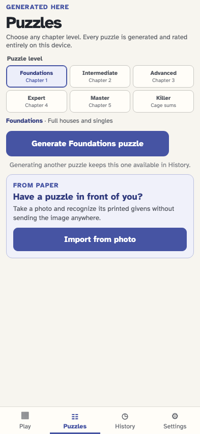

**Verifications:**

- [x] Another puzzle can be generated without closing the active one

## The player opens history without entering a scrolling region

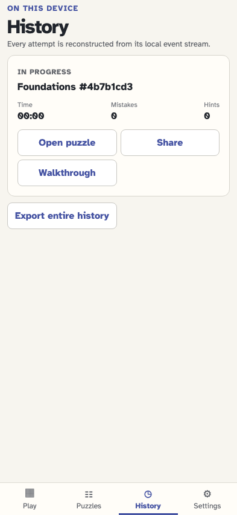

**Verifications:**

- [x] The current attempt is represented by one fixed-size card

## The player opens all local settings without scrolling

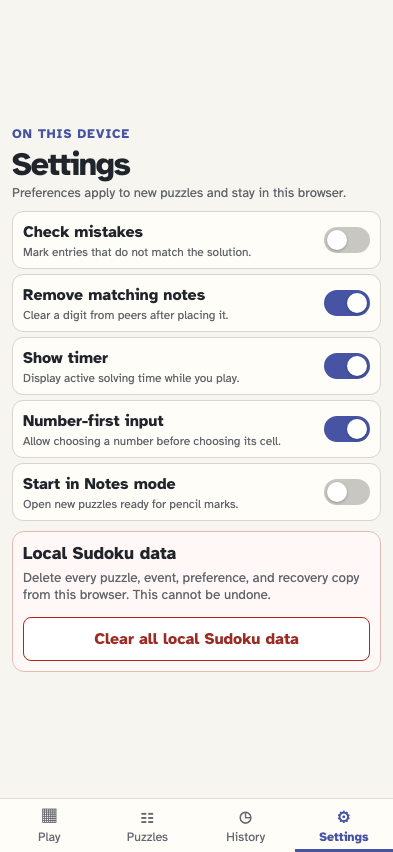

**Verifications:**

- [x] All five preference switches and the local-data action remain available
