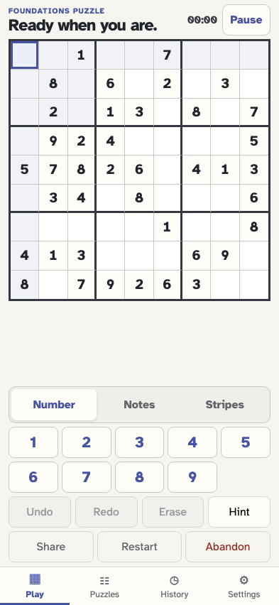
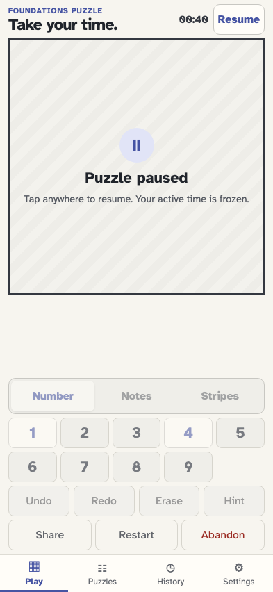
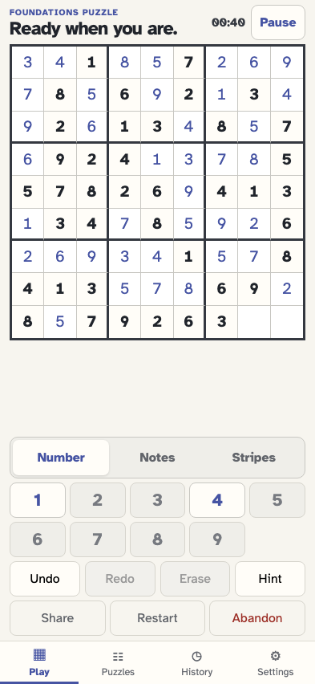
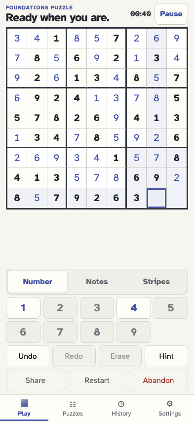
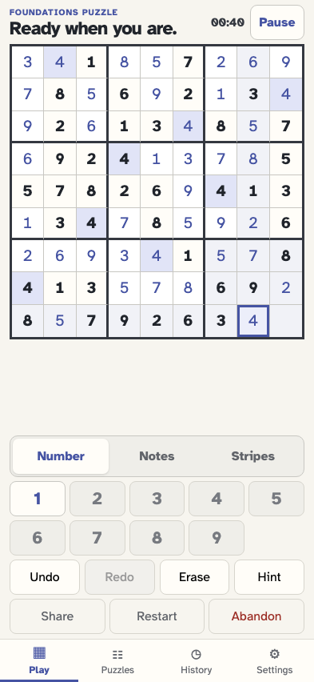
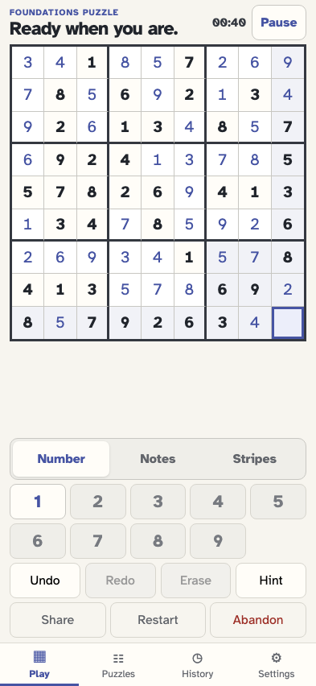
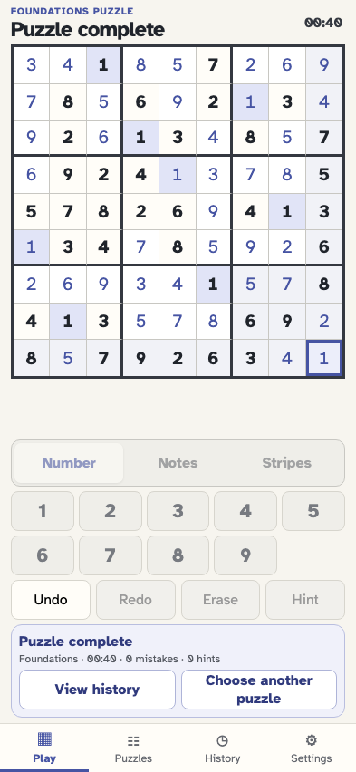
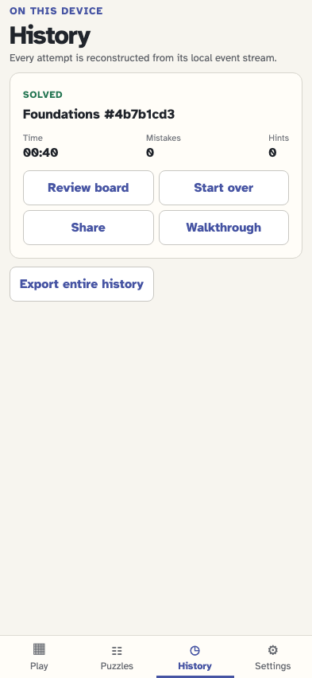
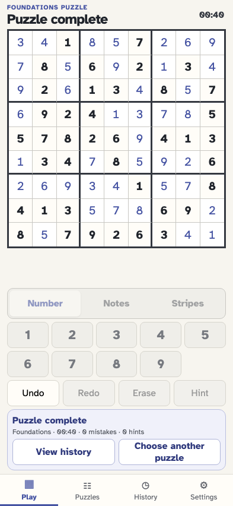

# Install once, then finish a puzzle offline

After one online installation, the player starts and pauses a real event-sourced puzzle, closes the page, reopens with the network disabled, resumes, solves, reviews History, and reloads. Application caches contain only bundled same-origin GET assets—not puzzle events.

## Online once, the player generates a validated puzzle and installs the application shell

**Verifications:**

- [x] game/started is persisted before the network is disabled
- [x] The service worker reports its precache ready
- [x] The installed shell checks the uncached same-origin revision manifest without changing the visible URL

## The player selects an editable cell while online

**Verifications:**

- [x] Selection is visible and still ephemeral

## The player commits one value before leaving the network

**Verifications:**

- [x] The value and cell/value-entered event are exact

## The player pauses the nearly completed game before closing the page

**Verifications:**

- [x] game/paused freezes the exact local board and timer

## With the network disabled, the player reopens the installed app

**Verifications:**

- [x] The cached application reconstructs the paused board from local events
- [x] Local persistence remains ready while offline

## The player resumes entirely offline

**Verifications:**

- [x] game/resumed appends locally and restores the exact two blanks

## The player selects the penultimate blank offline

**Verifications:**

- [x] The exact blank is selected

## The player enters the penultimate solution value offline

**Verifications:**

- [x] One blank remains and the event is local

## The player selects the final blank offline

**Verifications:**

- [x] The final empty cell is selected

## The final value derives completion without a completion event or network

**Verifications:**

- [x] The completion panel and solved board are visible
- [x] No redundant game/completed event exists

## The player opens the locally reconstructed solved History

**Verifications:**

- [x] The solved card retains its summary offline

## A second offline reload reconstructs the solved board

**Verifications:**

- [x] The solved event projection and completion summary remain available after reload

## The player reopens solved History after the offline reload

**Verifications:**

- [x] The solved history card is reconstructed again
- [x] Application caches contain only same-origin GET asset requests and no event-store data
