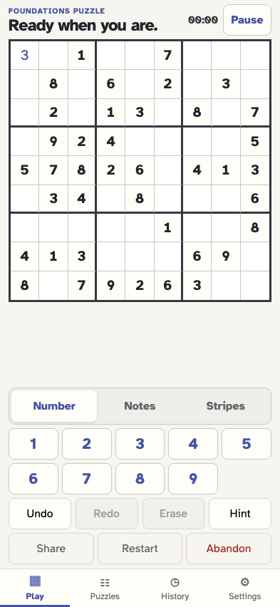
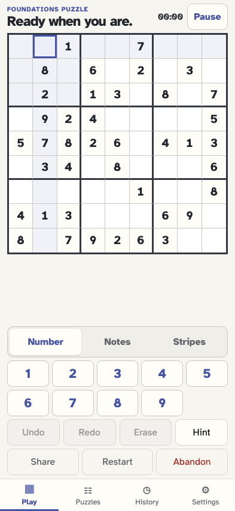
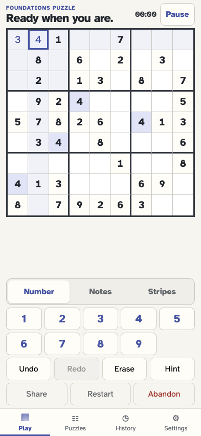
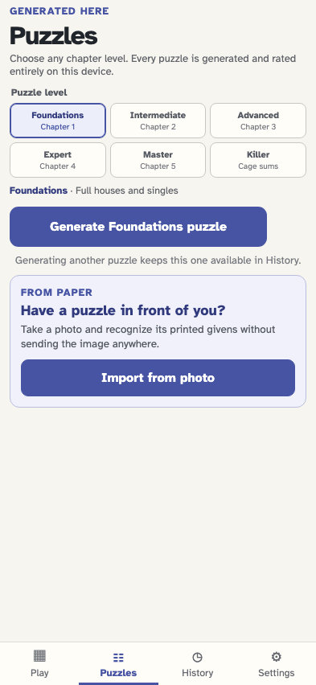

# Solve in more than one tab

Every puzzle has an independent IndexedDB event stream. Visible tabs viewing the same puzzle follow committed events and remain editable, while hidden tabs defer database work until focus; opening another puzzle affects only that tab.

## A second tab opens the same in-progress puzzle

**Verifications:**

- [x] The complete board is reconstructed from IndexedDB
- [x] Number input remains available in the second tab

## The first tab commits a value and the second catches up when focused

**Verifications:**

- [x] A hidden tab defers its database refresh until focus, then follows the committed value without reloading
- [x] The observing tab remains writable

## A background tab that missed the notification receives focus

**Verifications:**

- [x] The player can select a cell even before the stale stream catches up

## The focused tab catches up and commits its first action

**Verifications:**

- [x] The preflight refresh retains the earlier value and accepts the new one
- [x] Other tabs recover the takeover event when focused, even without its notification

## The player opens the puzzle library while the first puzzle remains active

**Verifications:**

- [x] Generation remains available with an in-progress puzzle
- [x] The interface explains that the current puzzle remains in History

## The second tab opens another independent puzzle stream

**Verifications:**

- [x] The new board starts without either earlier entry
- [x] The first tab stays on its original puzzle and retains both values
