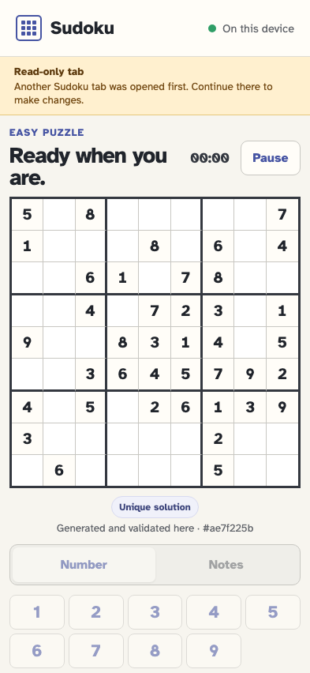
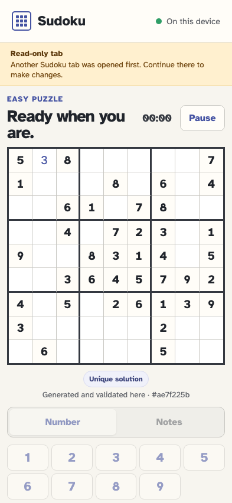

# Protect the active game from a second tab

Opening Sudoku again never creates a silent second writer. The later tab becomes a live read-only view while the first tab retains authority.

## The later tab detects the already-open Sudoku session

**Verifications:**

- [x] A specific read-only banner identifies the first tab as the place to continue
- [x] Every number input is disabled in the later tab

## The first tab places a value and the later tab refreshes from storage

**Verifications:**

- [x] The later board shows the exact value written by the first tab
- [x] The later tab remains read-only after refreshing
