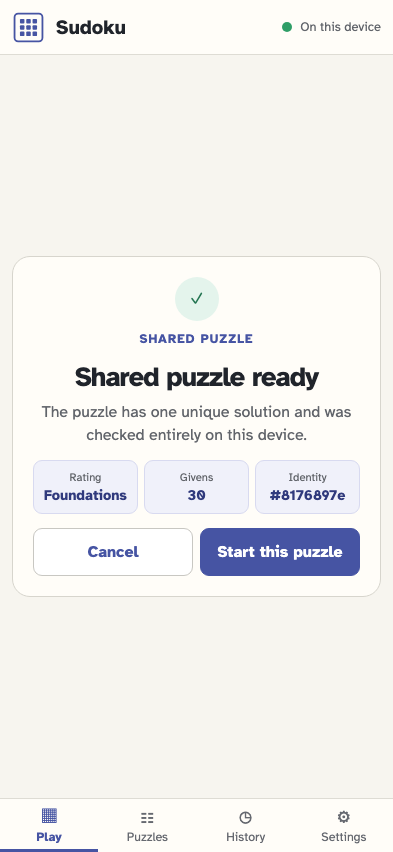
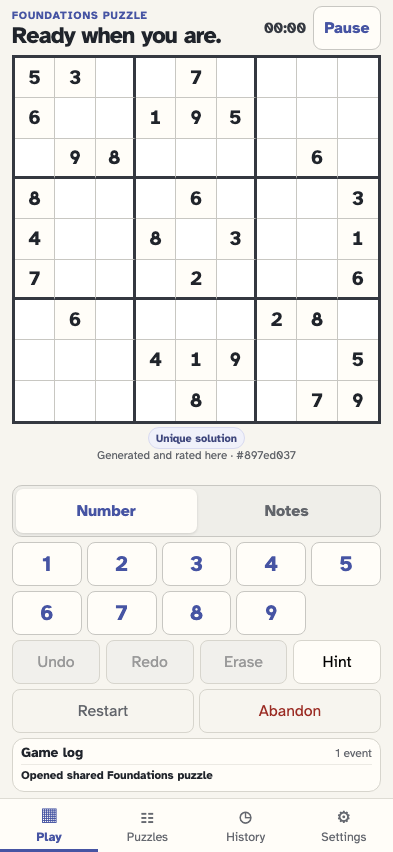

# Open a checked puzzle URL

The URL supplies only givens. The app proves uniqueness, derives the solution locally, asks before storing anything, and then starts one imported event stream.

## The shared givens have been checked and are ready for consent

**Verifications:**

- [x] The checked summary reports one unique solution and 30 givens
- [x] Validation alone writes no event and leaves the puzzle parameter visible

## Consent starts the exact checked puzzle as a new local event stream

**Verifications:**

- [x] The playable board has 81 cells and the exact 30 URL givens
- [x] One game/imported event stores the locally derived solution and explicit provenance
- [x] The consumed puzzle parameter is removed and the game log names the shared origin
