# Move a puzzle to another device

Every player action is shown below. The source pauses, renders its QR locally, and the recipient validates one compact checkpoint before storing it as a new event stream.

## The player generates a fresh local puzzle

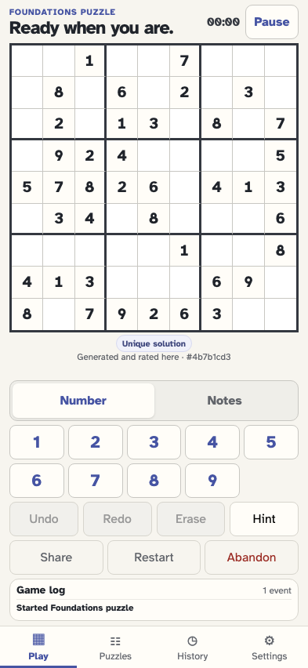

**Verifications:**

- [x] The board and Share action are ready

## The player selects an empty cell

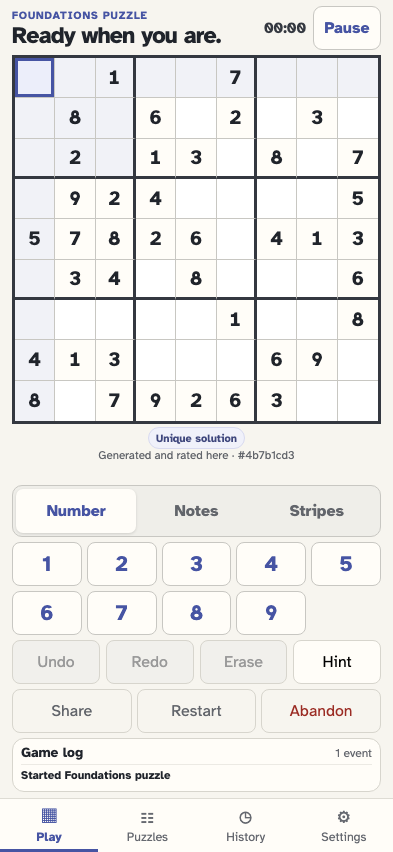

**Verifications:**

- [x] The selected cell is visible but selection creates no event

## The player enters 3 in the selected cell

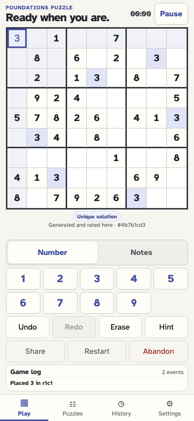

**Verifications:**

- [x] The value is stored as one canonical move

## The player selects a second empty cell for a pencil note

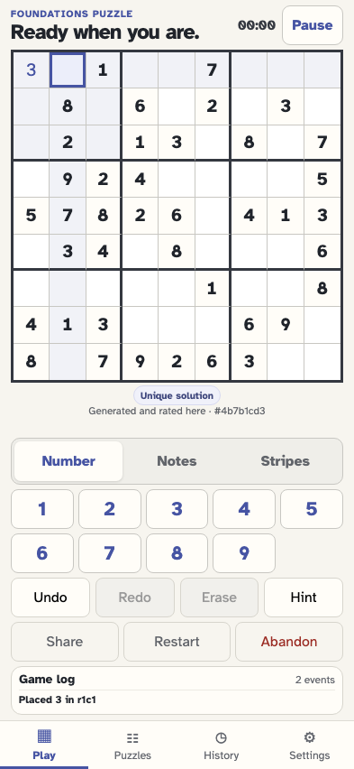

**Verifications:**

- [x] The second cell is selected without changing history

## The player switches to Notes mode

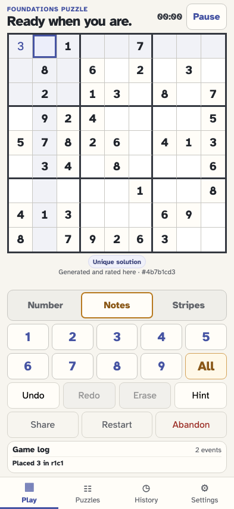

**Verifications:**

- [x] Notes mode is pressed and remains ephemeral

## The player adds pencil note 2

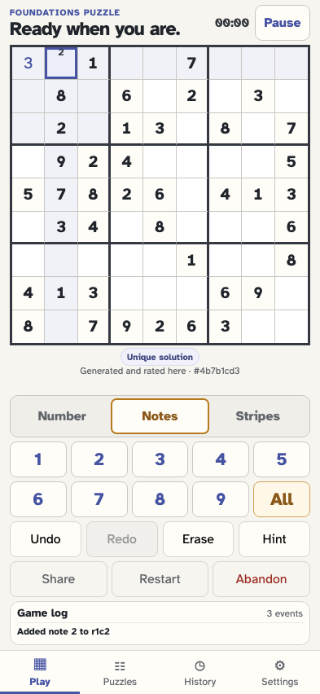

**Verifications:**

- [x] The note is stored in one note event

## The player opens the local sharing choices

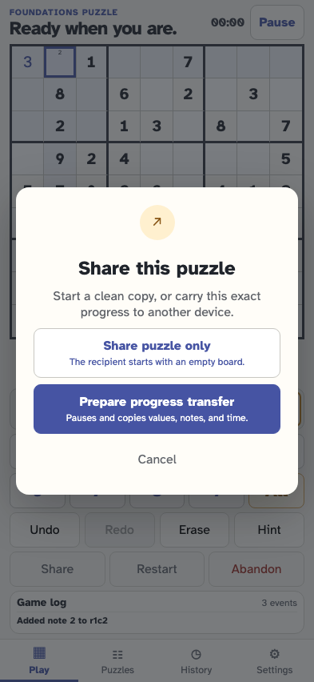

**Verifications:**

- [x] Puzzle-only and progress transfer are distinct choices

## The player first prepares a clean puzzle link

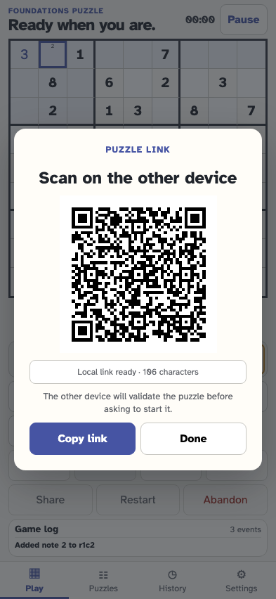

**Verifications:**

- [x] Its locally rendered QR carries only the literal givens query
- [x] Sharing only the puzzle neither pauses nor appends an event

## The player closes the clean-link dialog and keeps playing

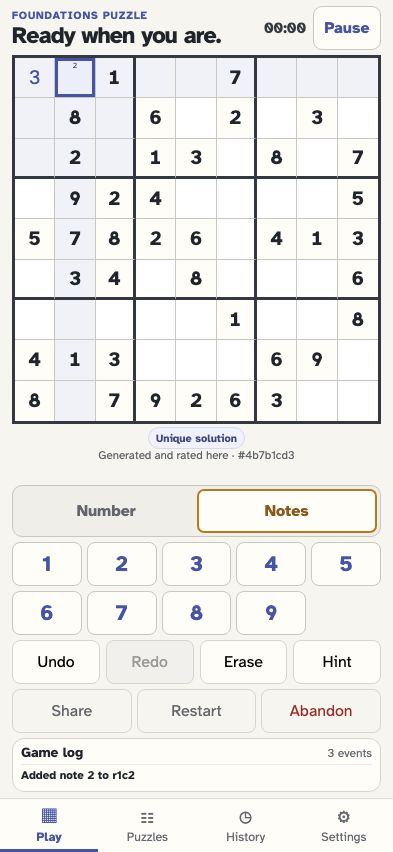

**Verifications:**

- [x] The dialog closes with the source puzzle still active

## The player opens Share again to carry current progress

**Verifications:**

- [x] Prepare progress transfer is available from the unchanged game

## The player freezes the checkpoint and gets a locally rendered QR code

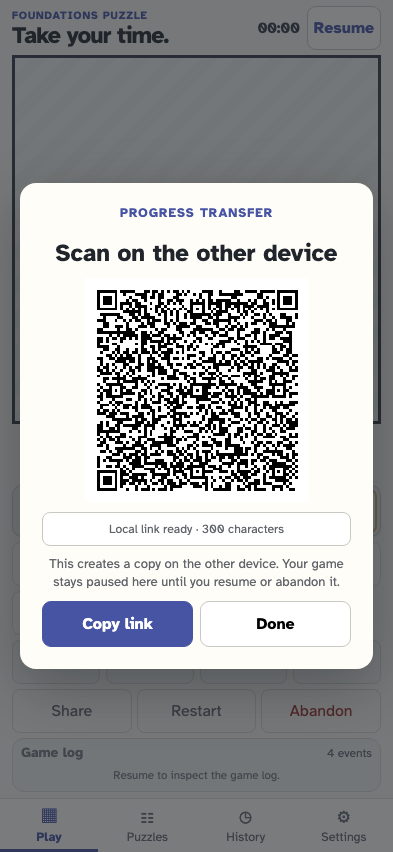

**Verifications:**

- [x] The dialog explains that the source remains paused
- [x] Only the ordinary pause event was added while preparing the transfer

## The player copies the same transfer link as an accessible QR alternative

**Verifications:**

- [x] Clipboard feedback is visible and the copied URL exactly matches the independently decoded QR

## The other device checks the scanned checkpoint before storing it

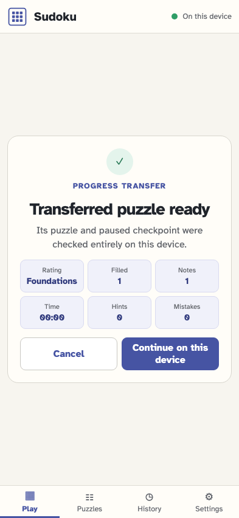

**Verifications:**

- [x] The consent summary preserves one value, one noted cell, and paused active time
- [x] Fragment data was not sent in any network request and no event exists yet

## The recipient consents and imports one paused checkpoint event

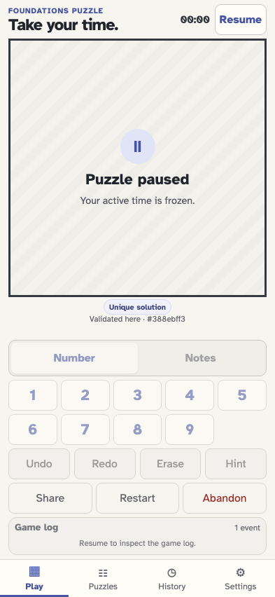

**Verifications:**

- [x] One import event contains the transferred settings and checkpoint
- [x] The consumed fragment is removed and the board starts paused

## The recipient resumes the copied game

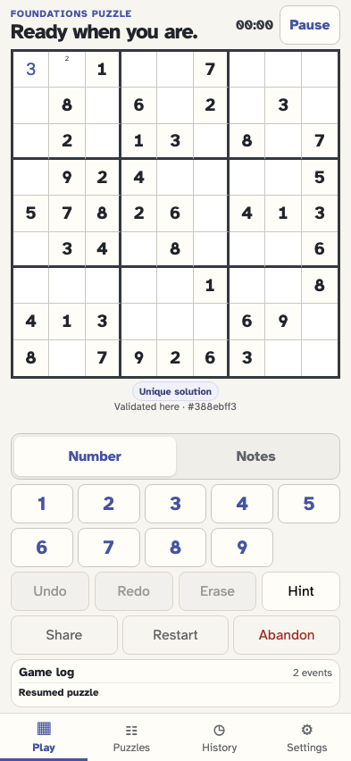

**Verifications:**

- [x] The transferred value and note reappear on the playable board

## The recipient selects another empty cell

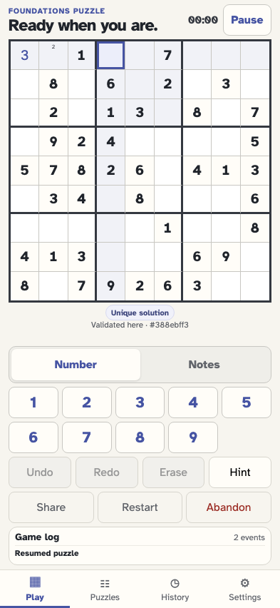

**Verifications:**

- [x] New play begins from the imported checkpoint

## The recipient enters 8 after the transfer

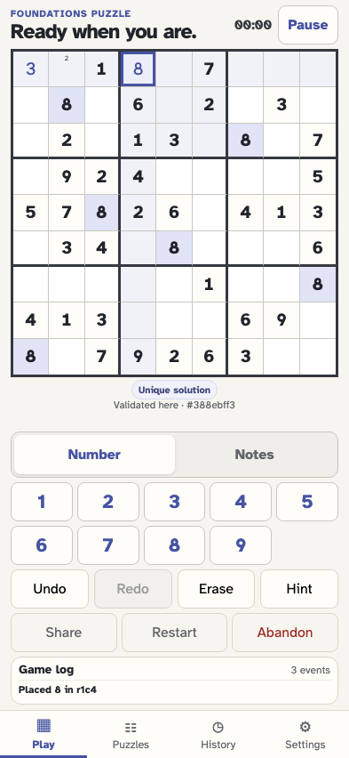

**Verifications:**

- [x] The new move is appended after import and resume

## Undo affects only the move made after import

**Verifications:**

- [x] The recipient move is empty again while transferred progress remains

## Scanning the same QR again opens the existing local game

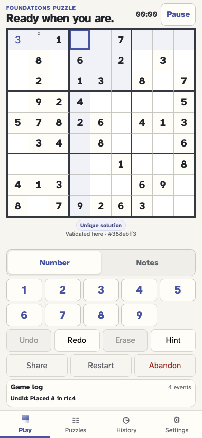

**Verifications:**

- [x] The transfer fragment clears without appending a duplicate import
