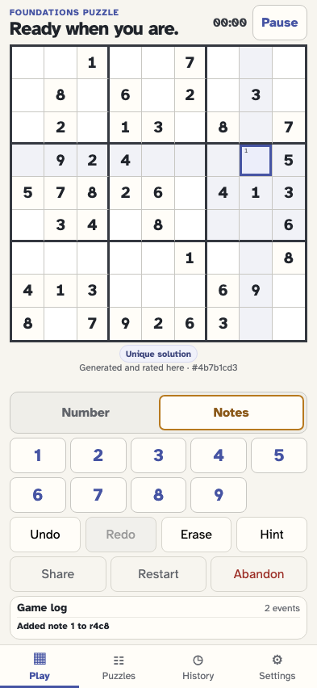
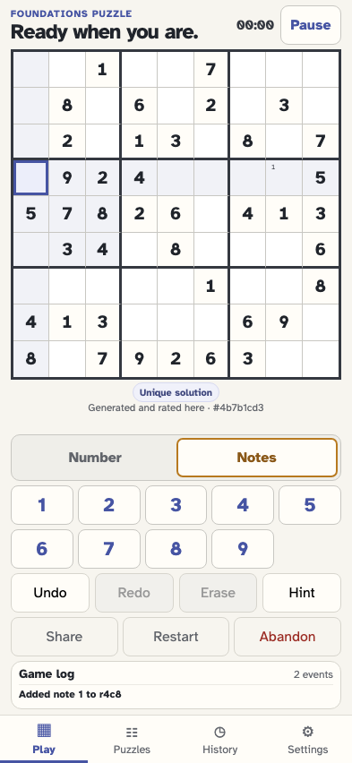
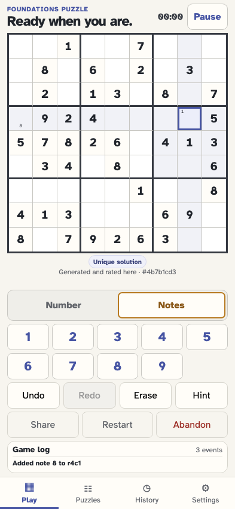
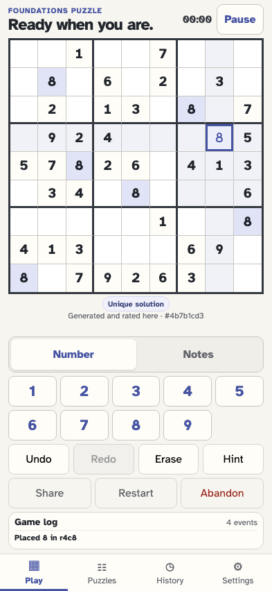
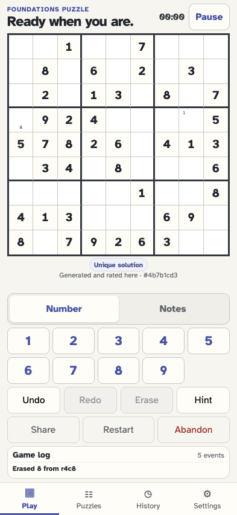
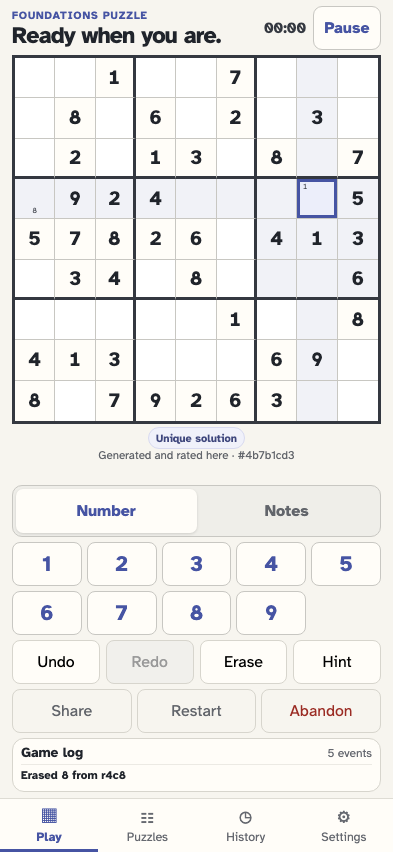
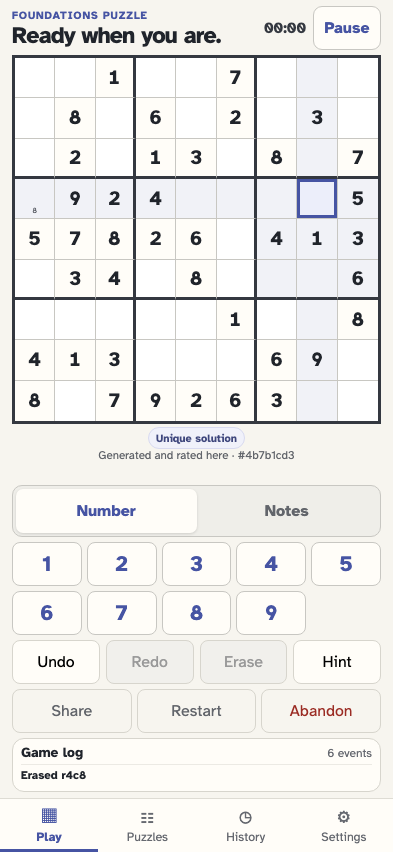

# Erase a value by replaying without its placement

The player adds notes to a cell and its peer, places a value that removes those notes, then erases the value. Replay restores every note affected by that exact placement; erasing a notes-only cell still clears only that cell.

## The player generates a puzzle for the replay correction

**Verifications:**

- [x] The target and its row peer are editable

## The player selects the target cell

**Verifications:**

- [x] Row 4 column 8 is selected

## The player switches to Notes mode

**Verifications:**

- [x] Notes mode is active

## The player adds note 1 to the target

**Verifications:**

- [x] The target exposes its original note

## The player selects a peer in the same row

**Verifications:**

- [x] Row 4 column 1 is selected

## The player adds matching note 8 to the peer

**Verifications:**

- [x] The peer exposes the matching note

## The player returns to the target cell

**Verifications:**

- [x] The target retains its note before placement

## The player switches to Number mode

**Verifications:**

- [x] Number mode is active

## The player places 8, clearing every note it affects

**Verifications:**

- [x] The target value replaces its old notes
- [x] Automatic cleanup removes the matching peer note

## The player erases the value and replay restores all affected notes

**Verifications:**

- [x] The target original note returns
- [x] The peer matching note returns
- [x] The erase event targets the exact placement instead of storing derived cell snapshots

## A reload reconstructs the restored notes from the event stream

**Verifications:**

- [x] The target note remains restored after reload
- [x] The peer note remains restored after reload

## The player selects the notes-only target

**Verifications:**

- [x] Erase is available for the restored marking

## The player erases markings without changing any peer

**Verifications:**

- [x] The target markings are empty
- [x] The peer note is untouched
- [x] A notes-only erase remains a simple cell/cleared event
