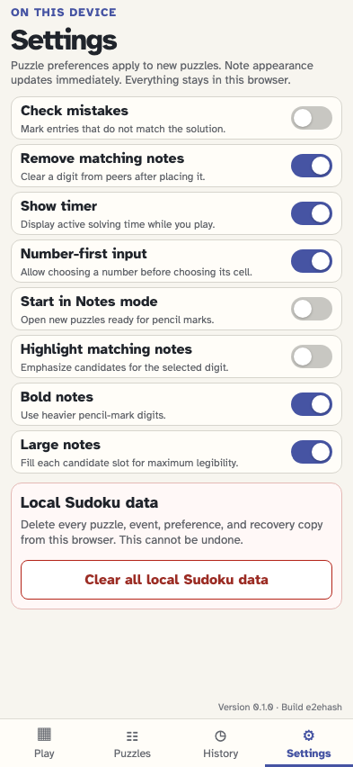

# Highlight solved digits, their exclusions, and matching notes

Matching candidate notes are emphasized by default when a filled digit is selected. The selected digit can still expand from its local peers to every matching digit’s peer set, and the note emphasis can be disabled in Settings.

## The player generates a board with repeated instances of a digit

**Verifications:**

- [x] Digit 1 appears in at least two fixed cells

## The first tap selects one 1, shows its peers, and emphasizes matching notes

**Verifications:**

- [x] Exactly the selected cell’s 20 peers use the local peer treatment
- [x] Every matching digit uses the ordinary blue matching treatment
- [x] Every matching candidate note is highlighted by default
- [x] The board handles taps without enabling double-tap zoom

## The second tap expands 1 highlighting across the puzzle in pink

**Verifications:**

- [x] Every instance of the digit has the number-wide treatment
- [x] The union of every matching digit’s peer set has the pink treatment
- [x] Both matching candidate notes remain emphasized
- [x] The pink peer colour is visually distinct from the blue local peer colour
- [x] The second tap leaves the browser zoom unchanged

## The third tap returns to the selected cell’s local blue peers

**Verifications:**

- [x] The 20 local peers are blue again
- [x] No number-wide pink highlight remains

## A rapid double tap remains an app gesture instead of zooming the browser

**Verifications:**

- [x] The visual viewport remains at its original scale
- [x] Both taps reach the puzzle and return the highlight to its local state

## The player disables candidate-note highlighting for more deliberate practice

**Verifications:**

- [x] The preference switch is off
- [x] The preference change is stored as a settings event

## The selected digit keeps its normal highlights without emphasizing its notes

**Verifications:**

- [x] No candidate note has the matching-note treatment
- [x] Both candidate notes remain on the board
