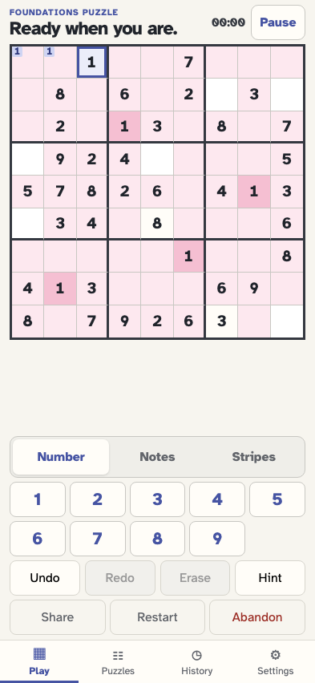
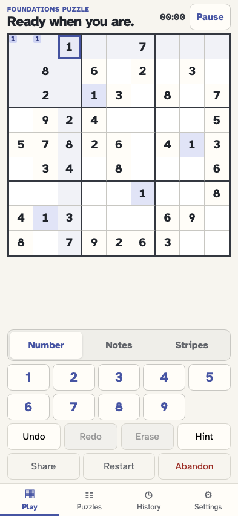

# Expand one cell highlight to every matching number

The first tap on a filled cell shows its own peers in blue. A second tap on that cell shows every occurrence of its digit and the union of all their peer sets in pink; a third tap returns to the local view.

## The player generates a board with repeated instances of a digit

**Verifications:**

- [x] Digit 1 appears in at least two fixed cells

## The first tap selects one 1 and shows its peers in blue

**Verifications:**

- [x] Exactly the selected cell’s 20 peers use the local peer treatment
- [x] Every matching digit uses the ordinary blue matching treatment
- [x] The board handles taps without enabling double-tap zoom

## The second tap expands 1 highlighting across the puzzle in pink

**Verifications:**

- [x] Every instance of the digit has the number-wide treatment
- [x] The union of every matching digit’s peer set has the pink treatment
- [x] The pink peer colour is visually distinct from the blue local peer colour
- [x] The second tap leaves the browser zoom unchanged

## The third tap returns to the selected cell’s local blue peers

**Verifications:**

- [x] The 20 local peers are blue again
- [x] No number-wide pink highlight remains

## A rapid double tap remains an app gesture instead of zooming the browser

**Verifications:**

- [x] The visual viewport remains at its original scale
- [x] Both taps reach the puzzle and return the highlight to its local state
