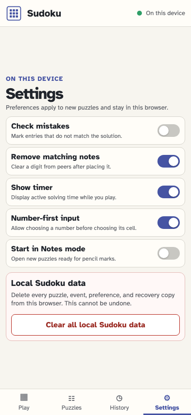
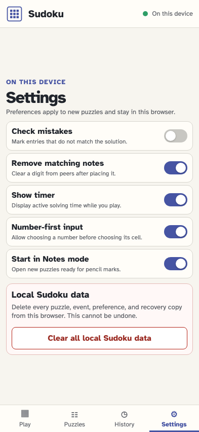
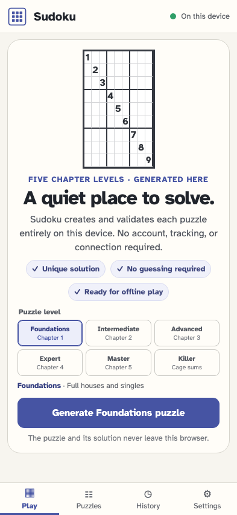
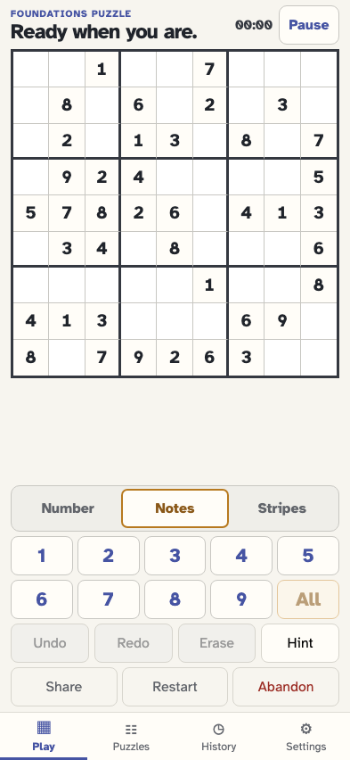
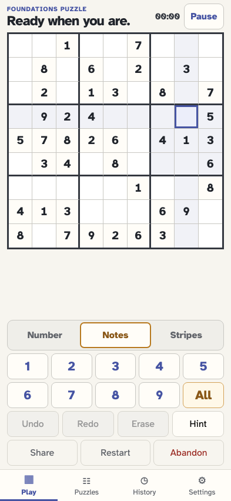
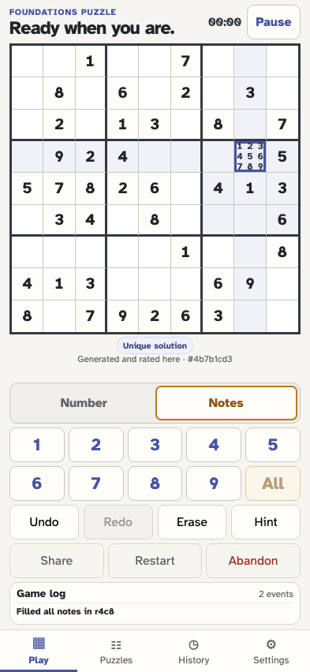
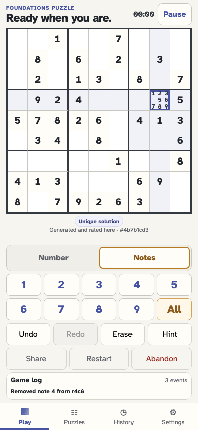
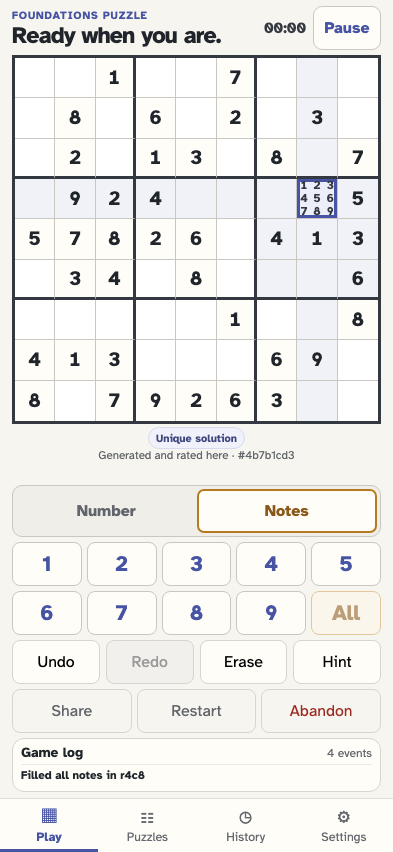
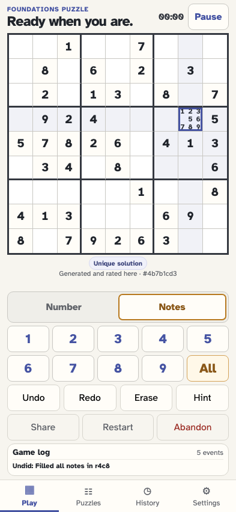

# Start in Notes mode and fill every pencil mark

The player enables the local Notes default, generates a puzzle, selects a cell, and uses the All key after 9. One reversible event fills notes 1–9; individual notes still toggle normally.

## The player opens device-local Settings

**Verifications:**

- [x] Start in Notes mode is available and initially off

## The player makes Notes the default for new puzzles

**Verifications:**

- [x] The preference is visibly on
- [x] One app-level settings event records notesFirst

## The player returns to Play

**Verifications:**

- [x] The local puzzle generator is ready

## The new puzzle opens directly in Notes mode

**Verifications:**

- [x] The game snapshots notesFirst and Notes is pressed
- [x] All notes appears immediately after digit 9 and waits for a cell

## The player selects an empty editable cell

**Verifications:**

- [x] All notes becomes available for the selected cell

## The player fills notes 1–9 with one All action

**Verifications:**

- [x] The cell exposes every note in order
- [x] Every visible note fills and stays inside its own 3×3 slot
- [x] One cell/notes-filled fact represents the action
- [x] All is disabled while every note is already present

## The player removes note 4 normally

**Verifications:**

- [x] Only note 4 is absent
- [x] The ordinary note toggle remains a separate event

## The player uses All again to restore the missing note

**Verifications:**

- [x] Notes 1–9 are complete again with one new fill event

## Undo reverses the one All action

**Verifications:**

- [x] Replay returns to the exact prior notes with 4 absent
