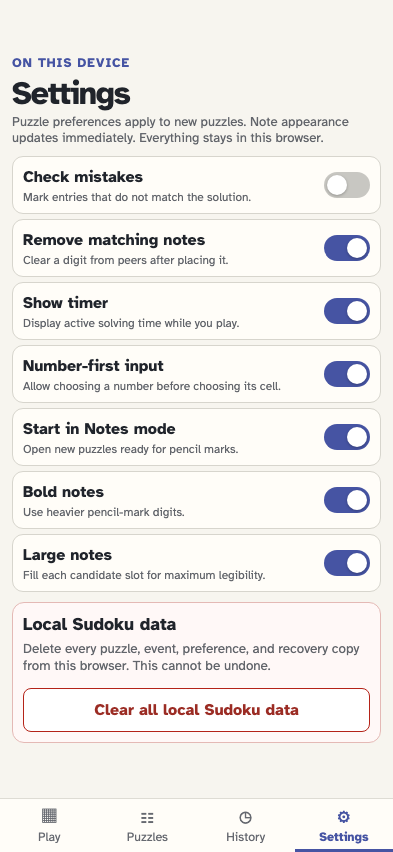
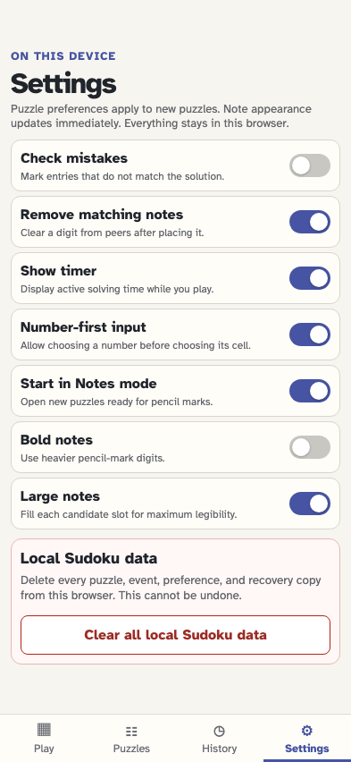
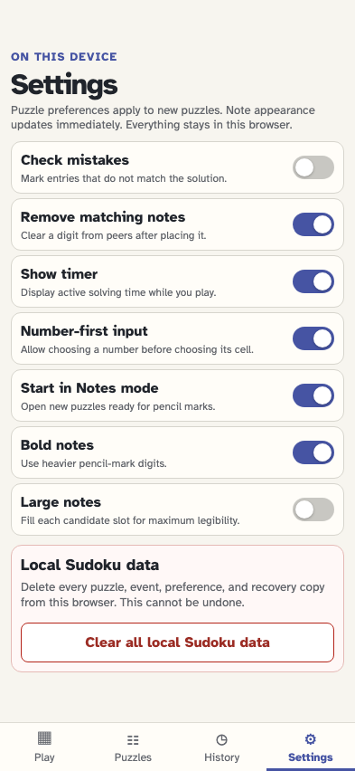
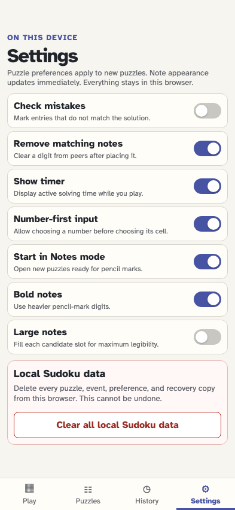
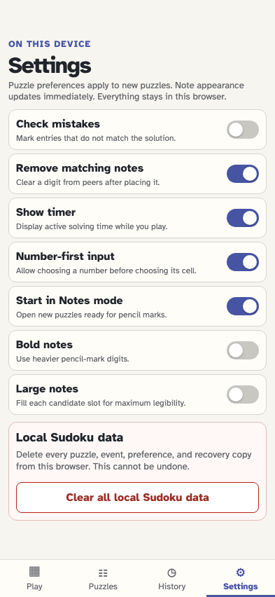
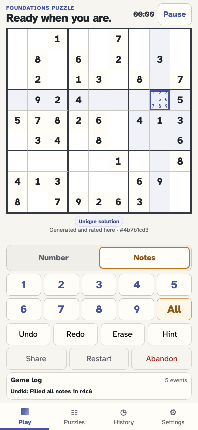

# Start in Notes mode, fill every pencil mark, and try four styles

The player enables the local Notes default, fills notes 1–9 with one reversible event, and independently tries large and bold notes in all four combinations before continuing to toggle and undo notes.

## The player opens device-local Settings

**Verifications:**

- [x] Start in Notes mode is available and initially off

## The player makes Notes the default for new puzzles

**Verifications:**

- [x] The preference is visibly on
- [x] One app-level settings event records notesFirst

## The player returns to Play

**Verifications:**

- [x] The local puzzle generator is ready

## The new puzzle opens directly in Notes mode

**Verifications:**

- [x] The game snapshots notesFirst and Notes is pressed
- [x] All notes appears immediately after digit 9 and waits for a cell

## The player selects an empty editable cell

**Verifications:**

- [x] All notes becomes available for the selected cell

## The player fills notes 1–9 with one All action

**Verifications:**

- [x] The cell exposes every note in order
- [x] Every visible note fills and stays inside its own 3×3 slot
- [x] Bold and Large notes are both on by default
- [x] One cell/notes-filled fact represents the action
- [x] All is disabled while every note is already present

## The player opens note appearance settings

**Verifications:**

- [x] Bold and Large are independent switches and both begin on

## The player turns Bold notes off while leaving Large notes on

**Verifications:**

- [x] The two switches show regular plus large
- [x] One app-level event records the Bold change

## The puzzle immediately shows large notes at regular weight

**Verifications:**

- [x] The first alternative combines not bold plus large

## The player returns to Settings to try smaller notes

**Verifications:**

- [x] The previous Bold choice remains off

## The player restores Bold notes

**Verifications:**

- [x] Bold is on again and its event is stored

## The player turns Large notes off while keeping Bold notes on

**Verifications:**

- [x] The switches show bold plus not large and the event is stored

## The puzzle immediately shows smaller bold notes

**Verifications:**

- [x] The second alternative combines bold plus not large

## The player returns to Settings for the final combination

**Verifications:**

- [x] Large remains off while Bold remains on

## The player turns Bold notes off while Large notes stays off

**Verifications:**

- [x] Both appearance switches are off and the event is stored

## The puzzle immediately shows smaller notes at regular weight

**Verifications:**

- [x] The third alternative combines not bold plus not large

## The player removes note 4 normally

**Verifications:**

- [x] Only note 4 is absent
- [x] The ordinary note toggle remains a separate event

## The player uses All again to restore the missing note

**Verifications:**

- [x] Notes 1–9 are complete again with one new fill event

## Undo reverses the one All action

**Verifications:**

- [x] Replay returns to the exact prior notes with 4 absent
