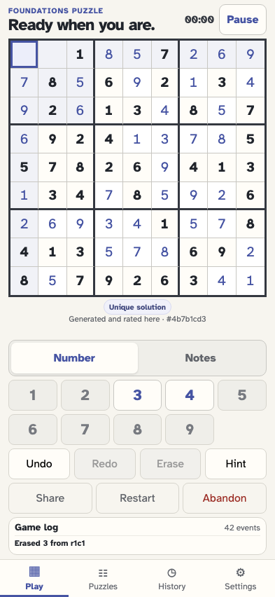

# Grey a completed digit until one copy is erased

A near-complete event stream leaves two different values open. Placing the ninth correct copy greys and disables that digit key; erasing the placement restores the key immediately.

## The player generates an event-sourced puzzle

**Verifications:**

- [x] The canonical stream contains game/started

## One correct 3 remains to be placed

**Verifications:**

- [x] Exactly two cells remain so the puzzle stays active after the target move
- [x] The 3 key reports one remaining and is available

## The player selects the last 3 cell

**Verifications:**

- [x] The target cell is selected and empty

## The player places the ninth 3 and its key turns grey

**Verifications:**

- [x] The 3 key reports zero remaining and is disabled
- [x] The completed key uses the explicit grey treatment
- [x] The unrelated final cell keeps the puzzle active

## The player erases that placement and the 3 key returns

**Verifications:**

- [x] The 3 key reports one remaining and is enabled again
- [x] Replay restores the selected cell to empty
