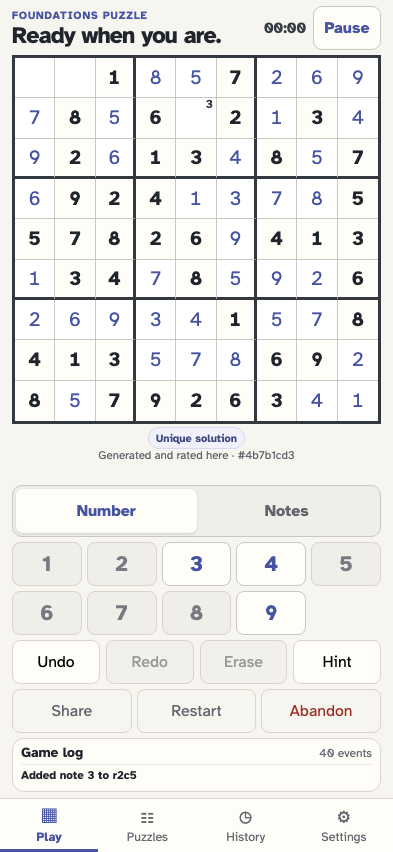
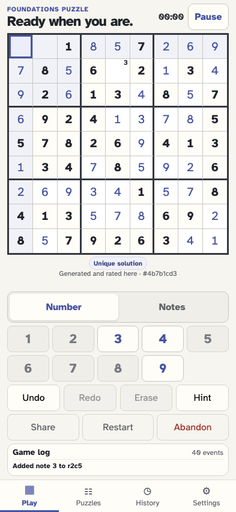
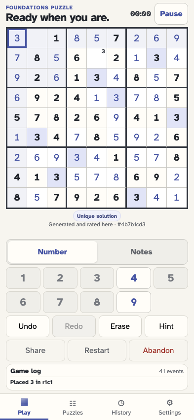
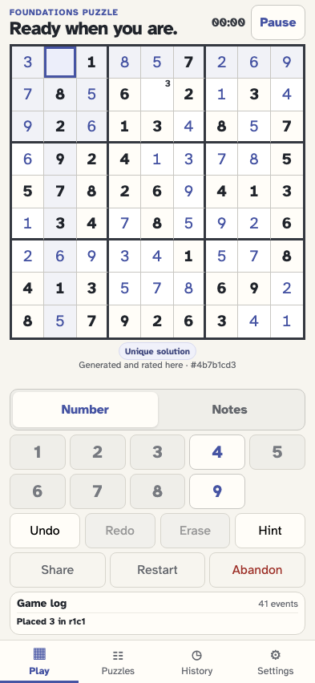
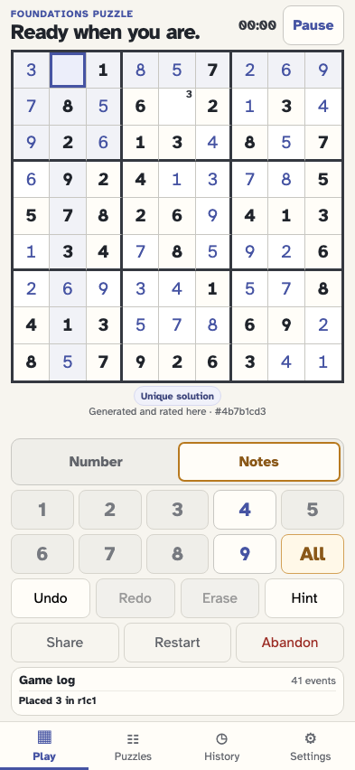
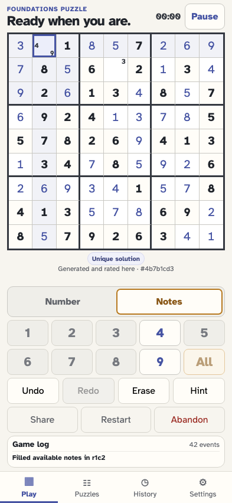
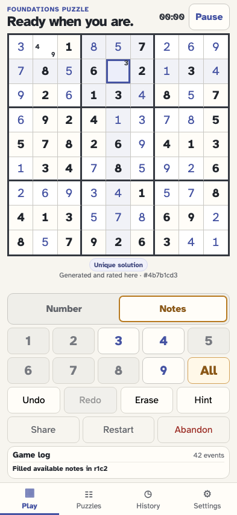
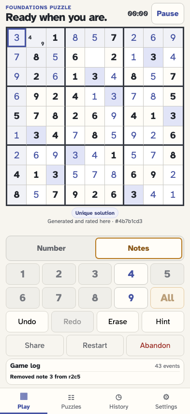
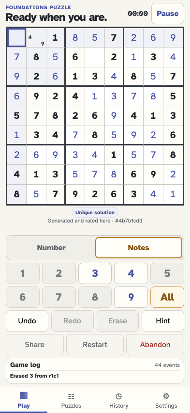

# Skip completed notes and keep their cleanup action available

A near-complete event stream includes one stale pencil mark. After the ninth correct copy is placed, All skips that digit, selecting its stale note enables the otherwise grey key, and tapping it erases the note.

## The player generates an event-sourced puzzle

**Verifications:**

- [x] The canonical stream contains game/started

## One correct 3 remains to be placed

**Verifications:**

- [x] Exactly three cells remain so the puzzle stays active through note cleanup
- [x] A non-peer cell retains an old 3 note
- [x] The 3 key reports one remaining and is available

## The player selects the last 3 cell

**Verifications:**

- [x] The target cell is selected and empty

## The player places the ninth 3 and its key turns grey

**Verifications:**

- [x] The 3 key reports zero remaining and is disabled
- [x] The completed key uses the explicit grey treatment
- [x] The two unrelated cells keep the puzzle active

## The player selects an empty cell without the completed-digit note

**Verifications:**

- [x] The completed 3 key stays grey and disabled here

## The player enters Notes mode

**Verifications:**

- [x] All notes becomes available for the empty cell

## The player chooses All and it skips the completed 3

**Verifications:**

- [x] The new notes contain only digits with copies still missing
- [x] The event records exactly which available notes All added

## The player selects the cell with the stale 3 note

**Verifications:**

- [x] The 3 key is enabled even though zero copies remain
- [x] The actionable key no longer uses the grey treatment

## The player taps 3 to erase its stale note

**Verifications:**

- [x] The completed note is gone
- [x] With no 3 note to erase, the key is grey and disabled again
- [x] One ordinary note-toggle event records the erasure

## The player returns to the placed 3

**Verifications:**

- [x] Erase is available for that editable value

## The player erases that placement and the 3 key returns

**Verifications:**

- [x] The 3 key reports one remaining and is enabled again
- [x] Replay restores the selected cell to empty
