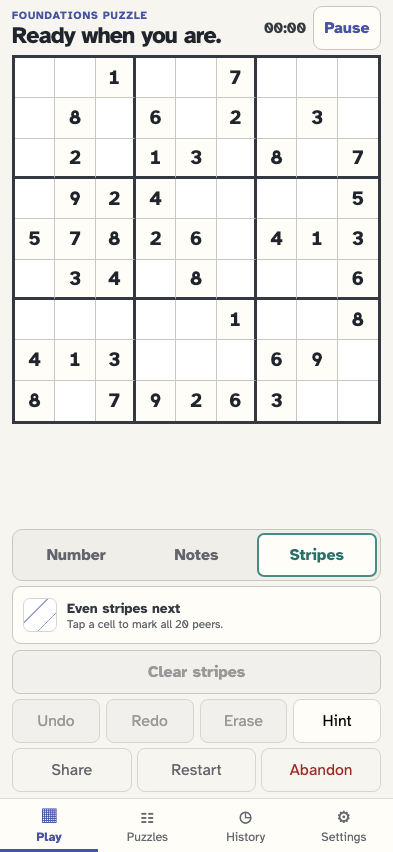
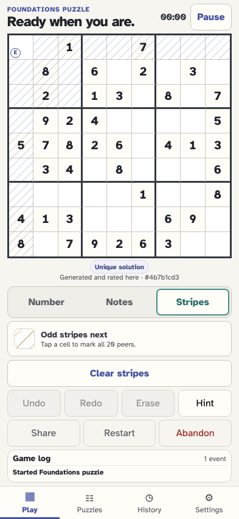
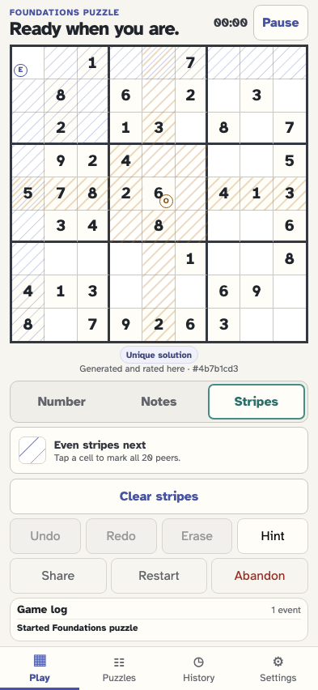
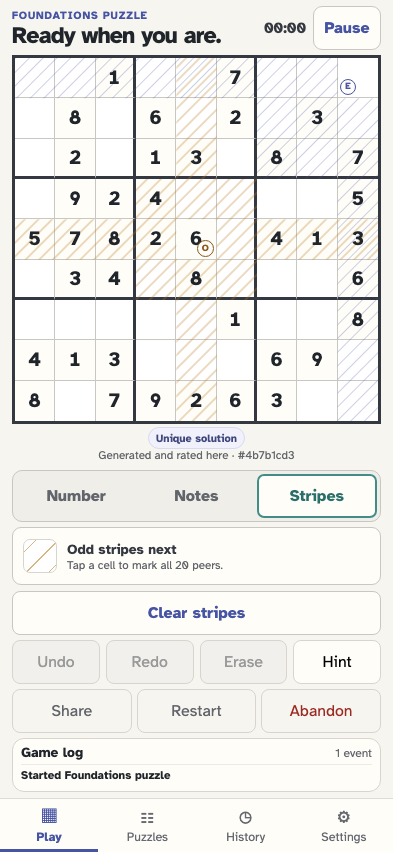
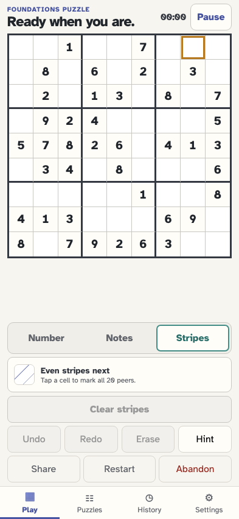

# Find shared peers with alternating Stripes

Stripes keeps the latest even and odd peer sets on the board. Each set uses sparse parallel lines of alternating parity, so cells reached by both taps become densely striped without changing the saved puzzle.

## The player opens the ephemeral Stripes input mode

**Verifications:**

- [x] Stripes is pressed and the first tap will use even stripes
- [x] The number pad is replaced by stripe guidance
- [x] Changing modes records no puzzle event

## The first tap lays sparse even stripes across its row, column, and box peers

**Verifications:**

- [x] Exactly the 20 peers of r1c1 carry even stripes
- [x] The tapped cell is identified as the even source but is not its own peer
- [x] The next tap switches to odd stripes without saving an event

## The second tap interleaves odd stripes so shared peers become densely striped

**Verifications:**

- [x] The latest odd source also marks exactly 20 peers
- [x] Only cells seen by both sources carry both stripe types
- [x] Both stripe types share one board-wide coordinate system
- [x] Both source cells and stripe types are announced accessibly

## A third tap replaces only the older even set and keeps the odd set

**Verifications:**

- [x] Even stripes now match the third tap instead of the first
- [x] The previous odd stripes remain unchanged
- [x] All three stripe taps remain ephemeral

## The player clears both overlays and resets the alternation

**Verifications:**

- [x] No stripe or source attributes remain on the board
- [x] Even stripes are ready for a fresh pair
- [x] Arrow and digit keys move focus without drawing or entering a value in Stripes mode
- [x] Clearing and keyboard navigation do not alter the event stream
