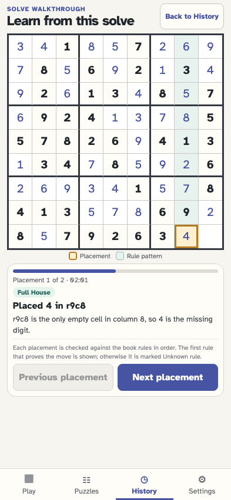

# Replay each placement with the simplest matching book rule

History analyzes a solve with visible progress, then jumps only between recorded placements. Each move names the first rule in the book order that proves it, or explicitly says Unknown rule.

## The solved History card offers Walkthrough directly after Share

**Verifications:**

- [x] The solved attempt has the four expected actions in order
- [x] Opening History and the walkthrough affordance append no events

## After visible analysis, the walkthrough opens directly on the first recorded placement

**Verifications:**

- [x] The instructional screen starts at placement 1 of 2
- [x] The first entered value is already present and only the final cell remains empty
- [x] The replay board is read-only and the event stream is unchanged

## The final placement is explained from the pre-move board and highlighted in context

**Verifications:**

- [x] The final move is identified as a provable Full House
- [x] One move cell and the other eight cells in its unit carry distinct highlights
- [x] The completed replay contains no empty editable cells and cannot advance past its last event

## The viewer steps backward and returns to the unchanged solved attempt

**Verifications:**

- [x] History returns to the same solved card
- [x] Walking forward and backward created no gameplay events
