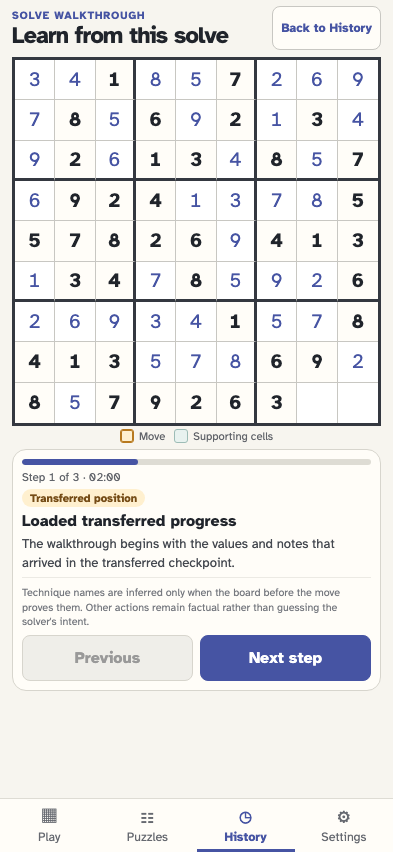
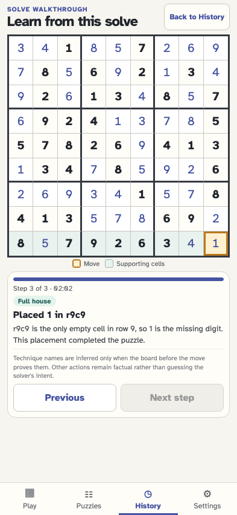
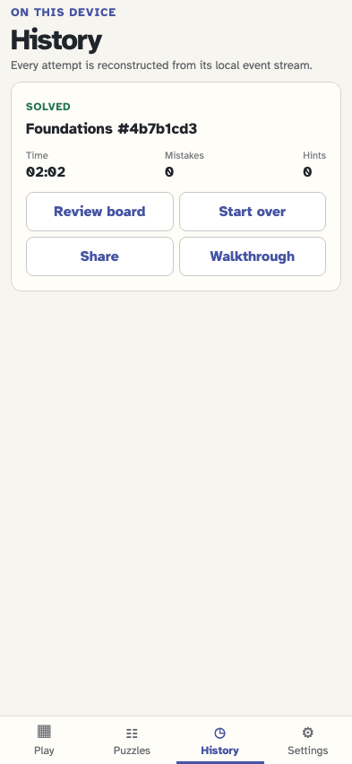

# Replay a solve as an instructional walkthrough

History can replay every recorded board action without changing it. Rules are named only when the board proves them, and the move plus its supporting cells are highlighted for another player.

## The solved History card offers Walkthrough directly after Share

**Verifications:**

- [x] The solved attempt has the four expected actions in order
- [x] Opening History and the walkthrough affordance append no events

## The walkthrough opens on the exact position where this recorded solve began

**Verifications:**

- [x] The instructional screen starts at step 1 of 3
- [x] The transferred checkpoint has exactly the two unsolved cells it recorded
- [x] The replay board is read-only and the event stream is unchanged

## The final placement is explained from the pre-move board and highlighted in context

**Verifications:**

- [x] The final move is identified as a provable Full house
- [x] One move cell and the other eight cells in its unit carry distinct highlights
- [x] The completed replay contains no empty editable cells and cannot advance past its last event

## The viewer steps backward and returns to the unchanged solved attempt

**Verifications:**

- [x] History returns to the same solved card
- [x] Walking forward and backward created no gameplay events
