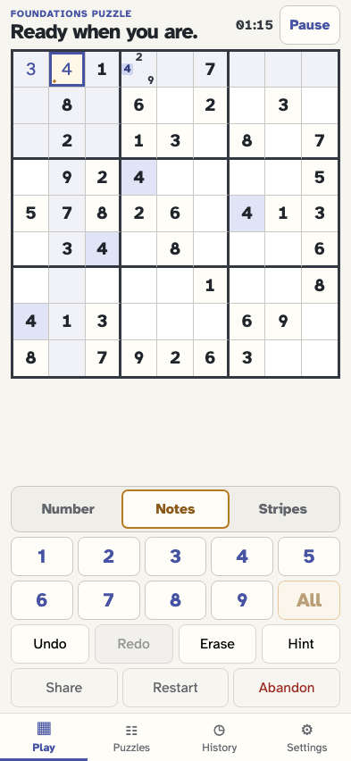
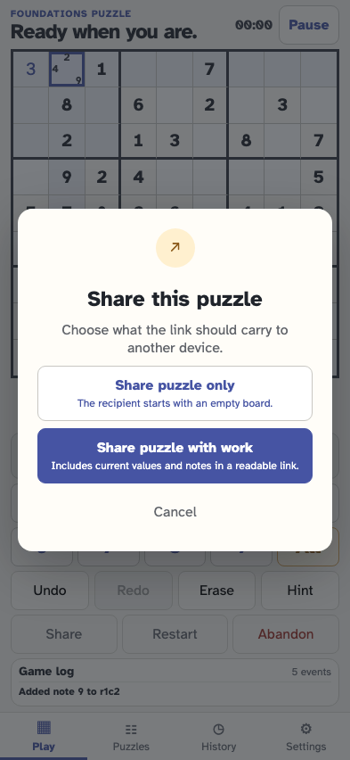
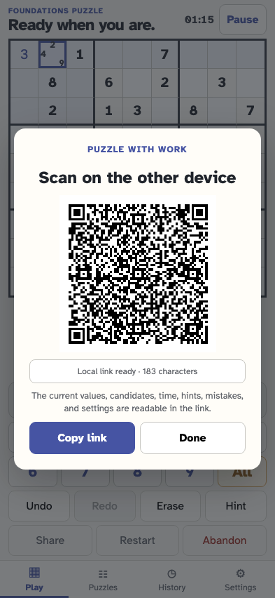
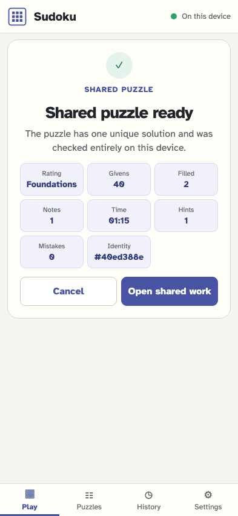
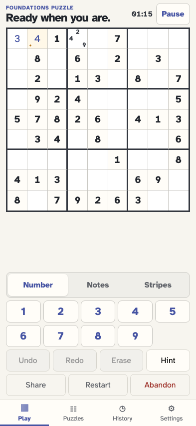

# Share a puzzle with its current work

The player can make a readable puzzle link containing placements and grouped candidates. The recipient checks it locally, sees a work summary, and opens the reconstructed board from one import event.

## The player adds one placement and three candidates

**Verifications:**

- [x] The board shows the placement and all three notes before sharing

## The player chooses how much state to share

**Verifications:**

- [x] Clean and readable-work choices remain distinct

## The app prepares a readable puzzle-work link without pausing

**Verifications:**

- [x] The decoded work has one placement and one grouped candidate action
- [x] The local QR exactly matches the link and sharing adds no event

## The recipient sees the checked puzzle and work summary before consent

**Verifications:**

- [x] The summary reports one filled and one noted cell
- [x] Validation remains ephemeral and offers to open shared work

## Consent reconstructs the work as one local import origin

**Verifications:**

- [x] The imported event separates givens from two compact work actions
- [x] The address is clean and the reconstructed board is immediately playable
