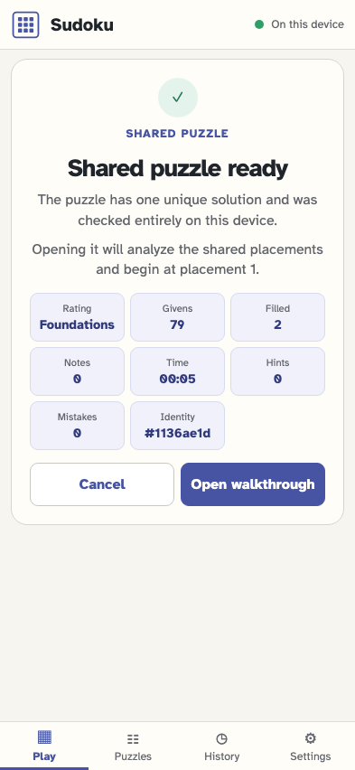
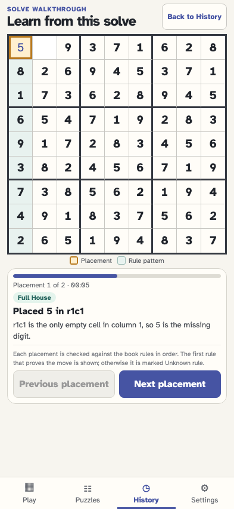
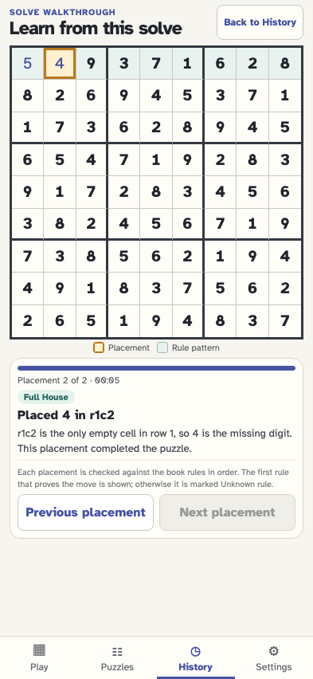

# Open a book link directly as a solve walkthrough

A validated progress link can request walkthrough presentation. Consent imports one origin, analyzes the ordered shared placements with visible progress, and opens at placement 1 without visiting the play board.

## The book link is validated before its progress is accepted

**Verifications:**

- [x] The preview identifies two placements and the requested walkthrough
- [x] Validation is still ephemeral and both query parameters remain until consent

## The imported solve opens directly on its first shared placement

**Verifications:**

- [x] The walkthrough starts at placement 1 of 2 with the first shared value highlighted
- [x] One import records the requested initial view and the consumed URL is clean

## The next action advances to the second shared placement

**Verifications:**

- [x] Placement 2 is a Full House and completes the replayed board
