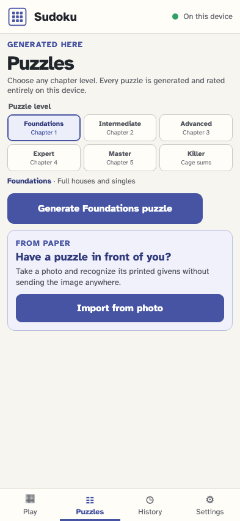
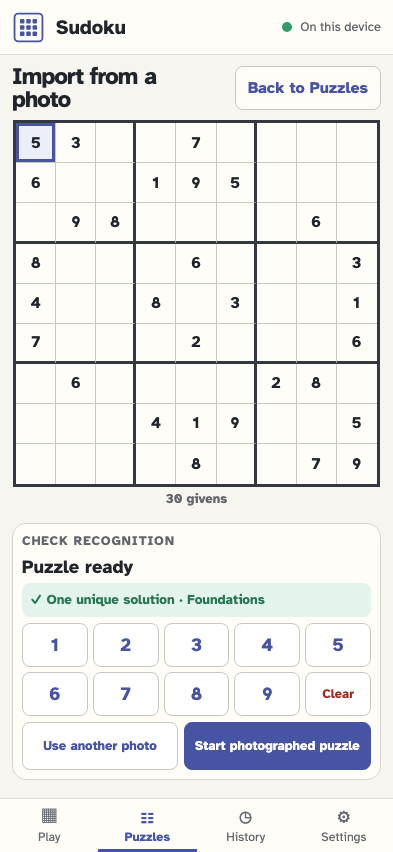
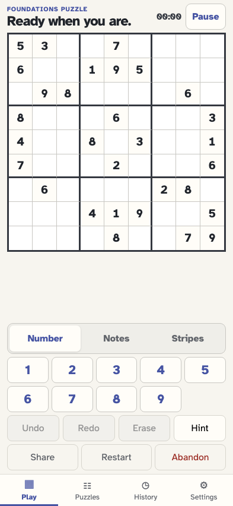

# Import a printed Sudoku with the camera

A player can select or photograph a conventional grid, recognize its printed givens entirely on-device, correct the result, prove that it has one unique solution, and start it as a normal local puzzle.

## The puzzle library offers private photo import beside generation

**Verifications:**

- [x] The photo option explains that the image is not sent anywhere

## The confident givens are checked and presented for acceptance

**Verifications:**

- [x] Every printed clue lands in its source cell and blank cells stay empty
- [x] The clean review is already proven and remains unsaved

## The corrected grid is proven before import

**Verifications:**

- [x] The review confirms one unique solution and its logical rating

## The photographed puzzle starts as a private local attempt

**Verifications:**

- [x] The playable board preserves the photographed givens
- [x] One camera-photo origin records the validated puzzle but never the image
