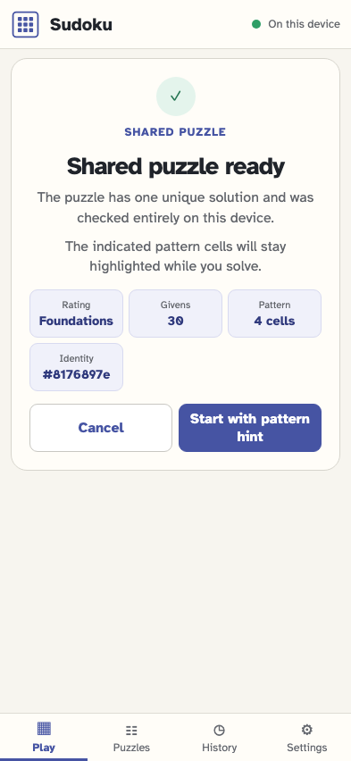
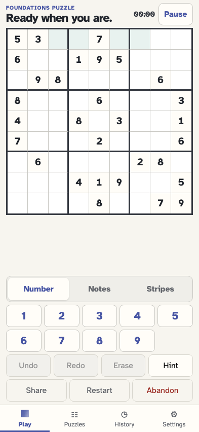
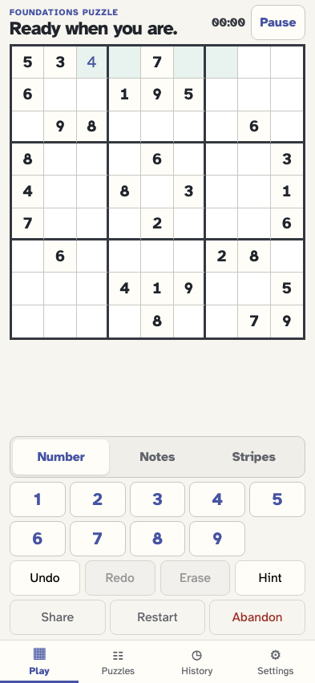
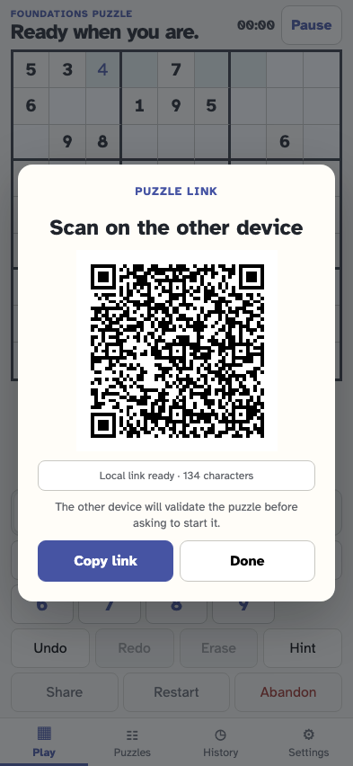

# Open a puzzle with a persistent pattern hint

An authored URL can mark cells with the walkthrough rule-pattern treatment without revealing their values. The checked import discloses the hint, and the marks survive solving, reload, and re-sharing.

## The pattern hint is disclosed before the puzzle is accepted

**Verifications:**

- [x] The checked summary reports four persistent pattern cells
- [x] Validation remains ephemeral until consent

## The authored cells use the existing rule-pattern highlight

**Verifications:**

- [x] Exactly the four URL cells are marked as rule-pattern context
- [x] One format 4 import stores the pattern without a revealed value

## Pattern marks remain after a placement and reload

**Verifications:**

- [x] The solved pattern cell and all other pattern cells remain highlighted
- [x] The user placement is ordinary work, not a revealed hint

## A clean re-share retains the authored pattern hint

**Verifications:**

- [x] The clean puzzle link contains pattern coordinates but omits player work
