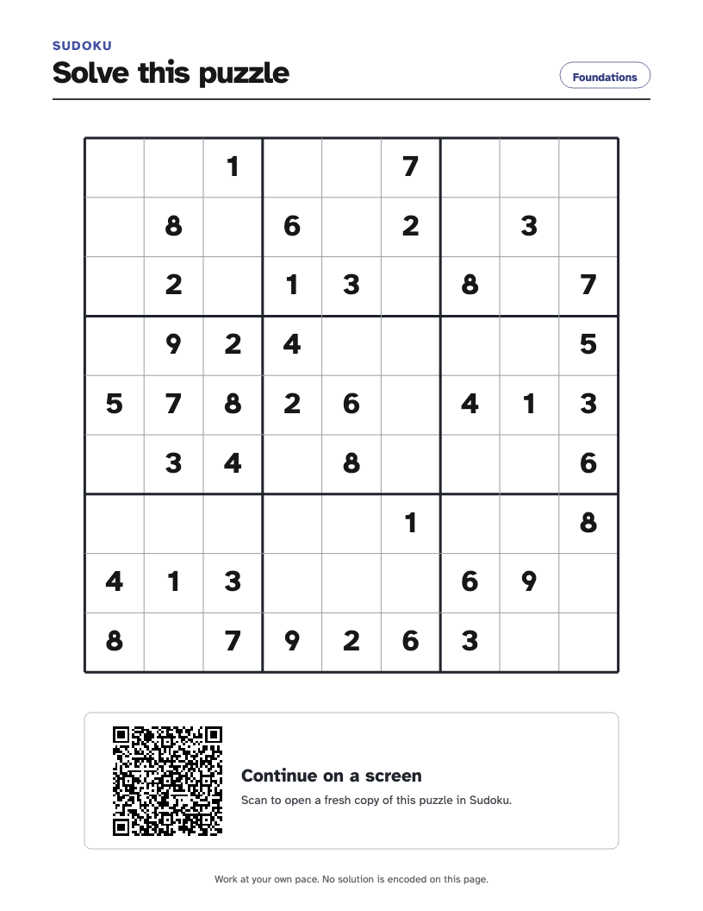
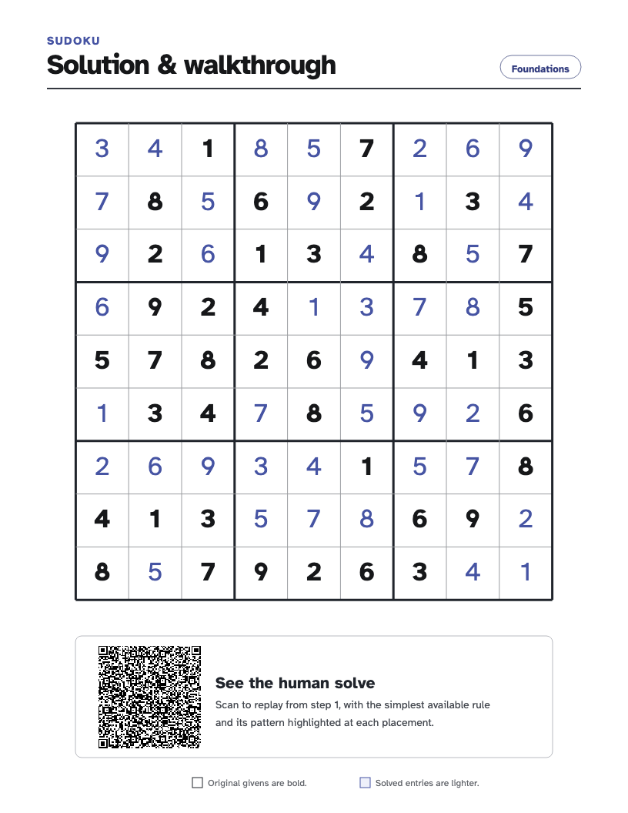

# Print a puzzle and its human walkthrough

Printing an active game produces two clean Letter pages: an unsolved hand-solving sheet with a link back to the puzzle, followed by its solution and a link that opens a human-ordered walkthrough at step 1.

## The hand-solving page

The first QR contains only the original givens. The printed grid has full-size empty cells for pencil work.

## The solution and walkthrough page

The second QR contains every correct placement in human-heuristic order and opens directly in walkthrough mode. The original givens remain visually distinct from solved entries.
