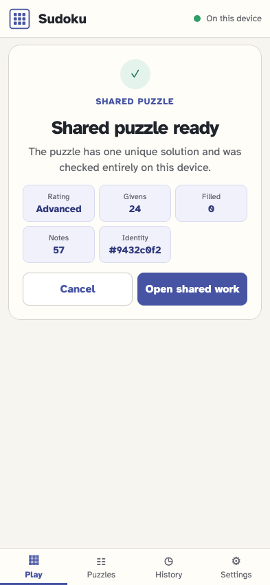
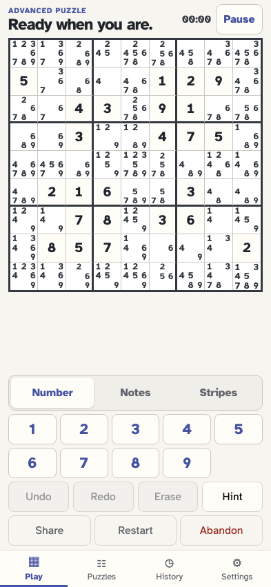
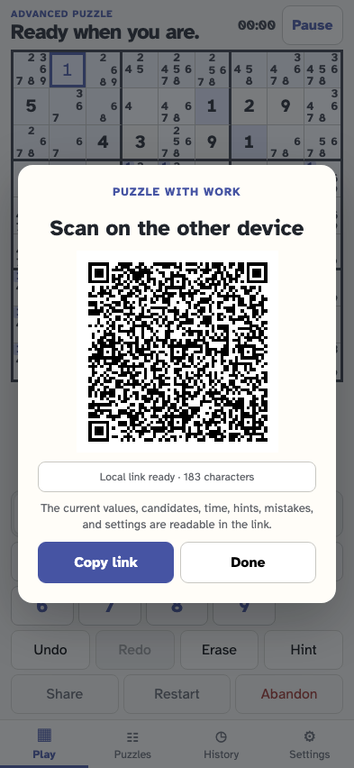
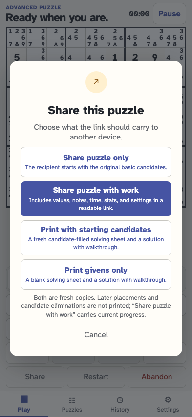

# Print and restart a candidate-ready puzzle

A compact givens=basic link computes the complete starting candidate grid locally and keeps it separate from later work. It can be shared with candidate removals, printed with a compact matching QR, reloaded, restarted, or opened through the legacy explicit-note form. Opening another link takes priority over preparing the old puzzle for print.

## The compact candidate-ready link is checked before it changes local history

**Verifications:**

- [x] The summary reports every computed candidate cell without treating them as progress

## The fresh puzzle opens with its complete starting candidate grid

**Verifications:**

- [x] Every cell exactly matches the candidates authored for it
- [x] The consumed puzzle and givens options are removed from the address

## Current work is encoded as changes from the compact candidate baseline

**Verifications:**

- [x] The link keeps givens=basic and explicitly carries the candidate removal and placement

## Restart returns to the authored candidate-ready starting point

**Verifications:**

- [x] The later placement and candidate elimination are removed
- [x] Restart remains one reversible event in the same local attempt

## Printing clearly separates a fresh candidate copy from a givens-only copy

**Verifications:**

- [x] Neither print option claims to print the player’s later work
