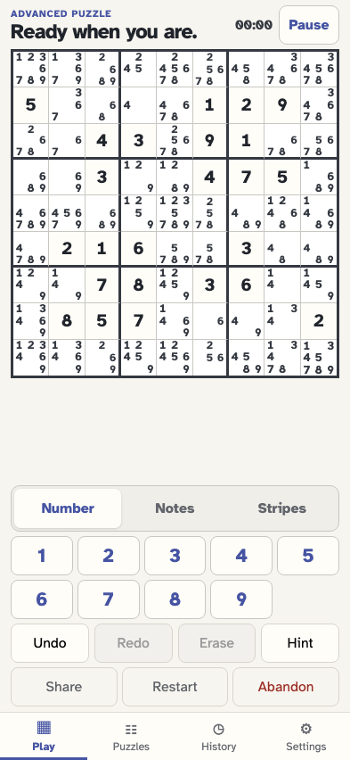
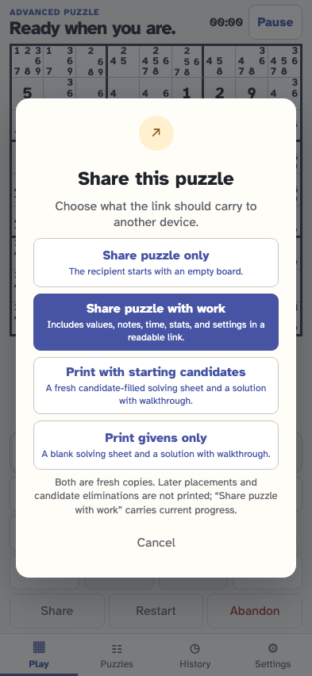

# Print and restart a candidate-ready puzzle

A puzzle authored with a complete starting candidate grid keeps that fresh state separate from later work. It can be printed with candidates and a matching QR, printed as givens only, reloaded, restarted, or opened again from the original link.

## The candidate-ready link is checked before it changes local history

**Verifications:**

- [x] The summary reports every supplied candidate cell and offers the shared work

## The fresh puzzle opens with its complete starting candidate grid

**Verifications:**

- [x] Every cell exactly matches the candidates authored for it

## Restart returns to the authored candidate-ready starting point

**Verifications:**

- [x] The later placement and candidate elimination are removed
- [x] Restart remains one reversible event in the same local attempt

## Printing clearly separates a fresh candidate copy from a givens-only copy

**Verifications:**

- [x] Neither print option claims to print the player’s later work
