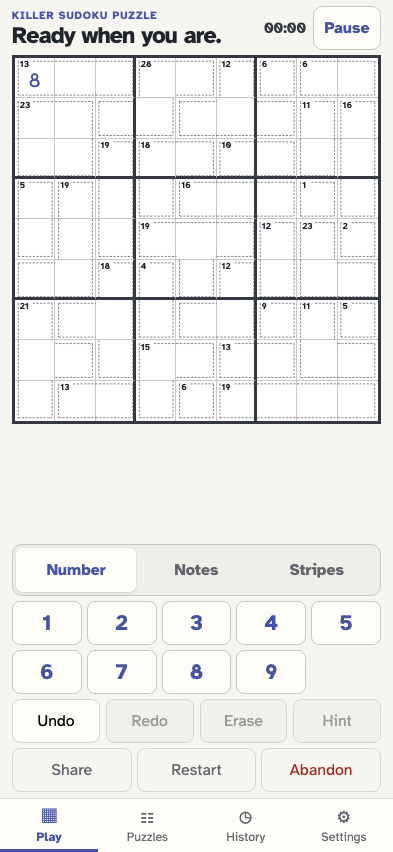

# Play and resume Killer Sudoku

As a solver, I can start a checked Killer puzzle, read its cage totals, make reversible moves, and return to the same rules and progress.

## A blank-givens Killer has labelled cages and ordinary number controls

**Verifications:**

- [x] The checked rules and cages are stored with the puzzle

## Reload restores the same cage sums and placement

**Verifications:**

- [x] Killer identity, cage count and placed digit survive reload
