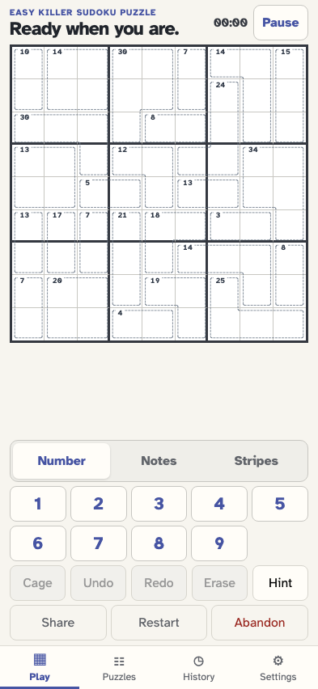
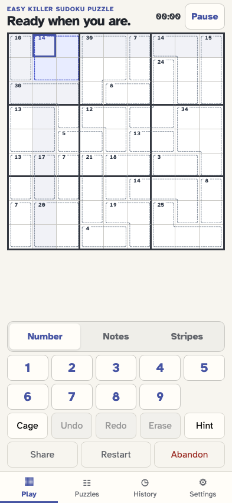
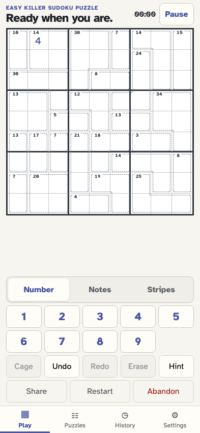
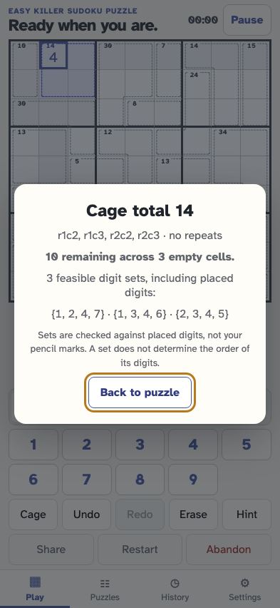
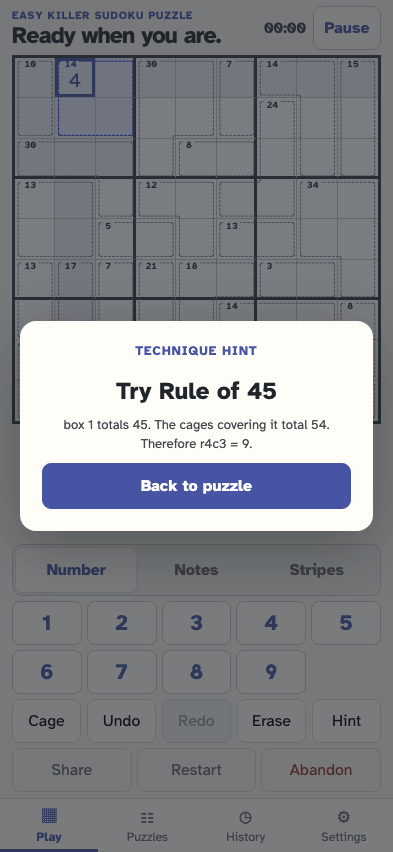

# Play and resume Killer Sudoku

As a solver, I can construct a fresh rated Killer without givens or one-cell cages, read centered cage totals in transparent border gaps, follow rounded boundaries through inside corners, see the entire selected cage highlighted, make reversible moves, return to the same rules and progress, inspect combinations, and request an explained deduction.

## A fresh Killer has continuous rounded cage outlines and centered sums in transparent border gaps

**Verifications:**

- [x] Keyboard focus enters the introduction, stays inside with Tab, and starts with Enter; checked cages are stored

## Selecting a cell lights up its whole cage with a pale fill and stronger dashed boundary

**Verifications:**

- [x] Mouse and keyboard selection move a single cage highlight without altering puzzle values

## Reload restores the same cage sums and placement

**Verifications:**

- [x] Killer identity, cage count and placed digit survive reload

## Inspect the selected cage without changing pencil marks or digits

**Verifications:**

- [x] The inspector contains keyboard focus, Escape returns to Cage, and remaining sum and feasible sets are explained

## A logical hint explains a cage or positional deduction without placing it

**Verifications:**

- [x] The explanation is a supported Killer deduction
