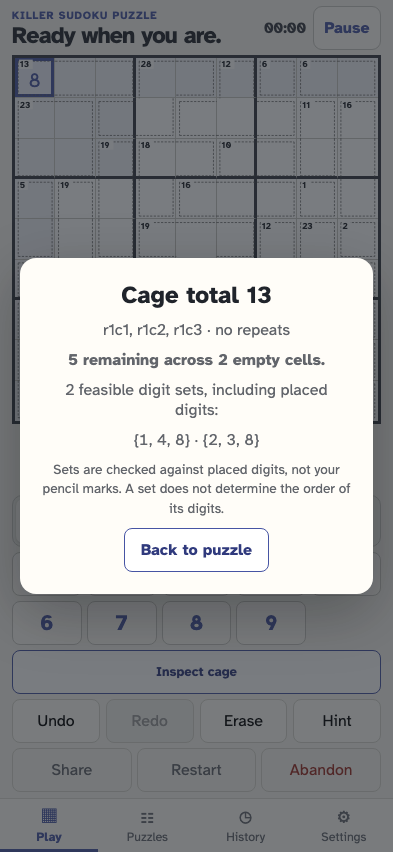
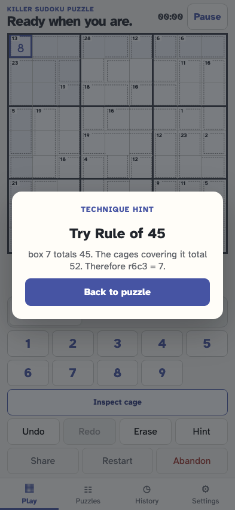

# Play and resume Killer Sudoku

As a solver, I can start a checked Killer puzzle, read its cage totals, make reversible moves, return to the same rules and progress, inspect combinations, and request an explained deduction.

## A blank-givens Killer has labelled cages and ordinary number controls

**Verifications:**

- [x] The checked rules and cages are stored with the puzzle

## Reload restores the same cage sums and placement

**Verifications:**

- [x] Killer identity, cage count and placed digit survive reload

## Inspect the selected cage without changing pencil marks or digits

**Verifications:**

- [x] The inspector explains remaining sum and feasible sets

## A logical hint explains a cage or positional deduction without placing it

**Verifications:**

- [x] The explanation is a supported Killer deduction
