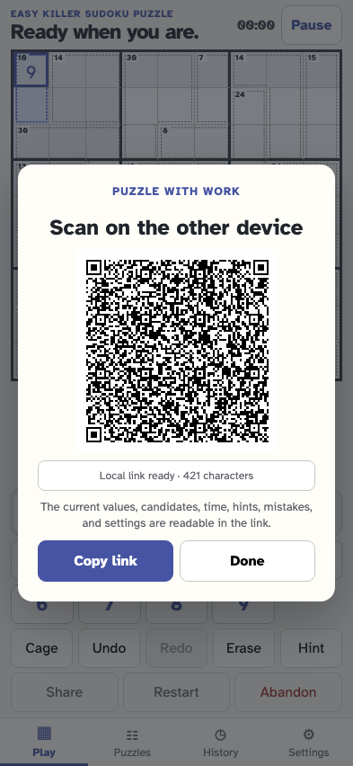
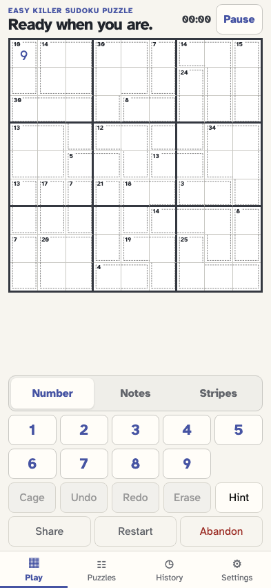

# Take a Killer puzzle with you

As a solver, I can share my Killer and its work, validate it on another device, and print both the puzzle and a complete explained walkthrough with their cages.

## Share a readable Killer work link with all cage rules

**Verifications:**

- [x] The work link identifies the Killer format and excludes the stored solution

## The checked import restores cage geometry and progress

**Verifications:**

- [x] A new local event stream carries the cage rules and the shared placement
