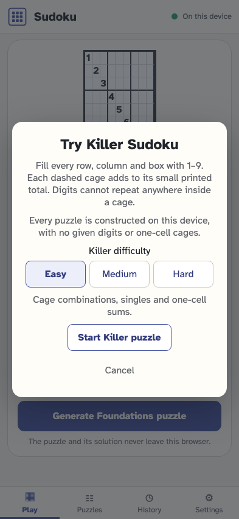
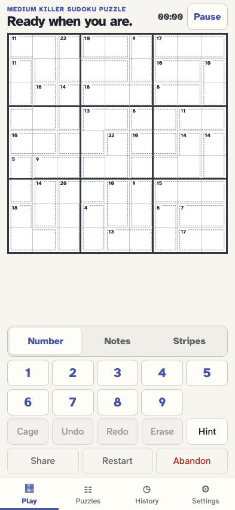
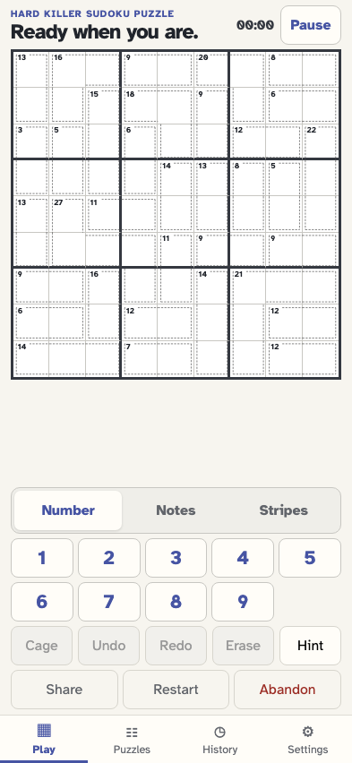

# Construct a Killer at your chosen difficulty

As a solver, I can choose Easy, Medium or Hard, generate a new puzzle without givens or one-cell cages, and read the actual logical difficulty on the board and in History.

## Choose a technique-based Killer difficulty before construction

**Verifications:**

- [x] Easy, Medium and Hard explain their solving techniques; there are no preset layouts

## Construct and play a new Medium Killer

**Verifications:**

- [x] The generated board records its level, version 2 provenance, and an entirely multi-cell cage partition

## Construct and play a new Hard Killer

**Verifications:**

- [x] The generated board records its level, version 2 provenance, and an entirely multi-cell cage partition
