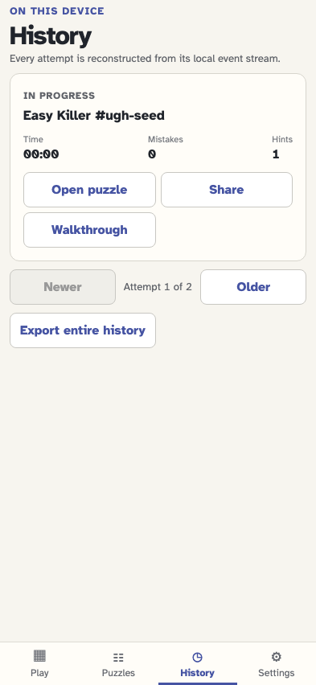
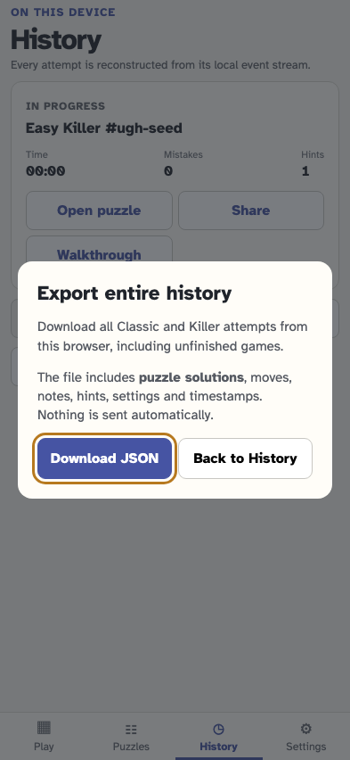
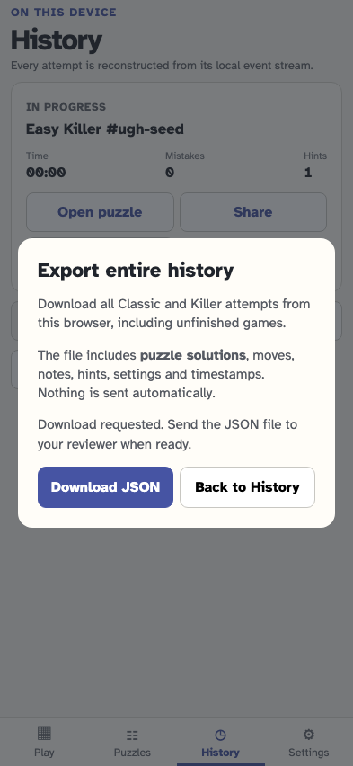

# Export all history for analysis

As a tester, I can download all retained Classic and Killer attempts as a versioned JSON file, including solutions and complete recorded events, then send the file to a reviewer myself.

## History offers a download covering every attempt, across all pages

**Verifications:**

- [x] The export control remains visible alongside paginated history

## Review the file contents before choosing Download JSON

**Verifications:**

- [x] The dialog discloses solutions and timestamps, keeps keyboard focus, and sends nothing automatically

## Download the JSON offline without altering any recorded event

**Verifications:**

- [x] The downloaded document equals all stored events and can be sent manually
